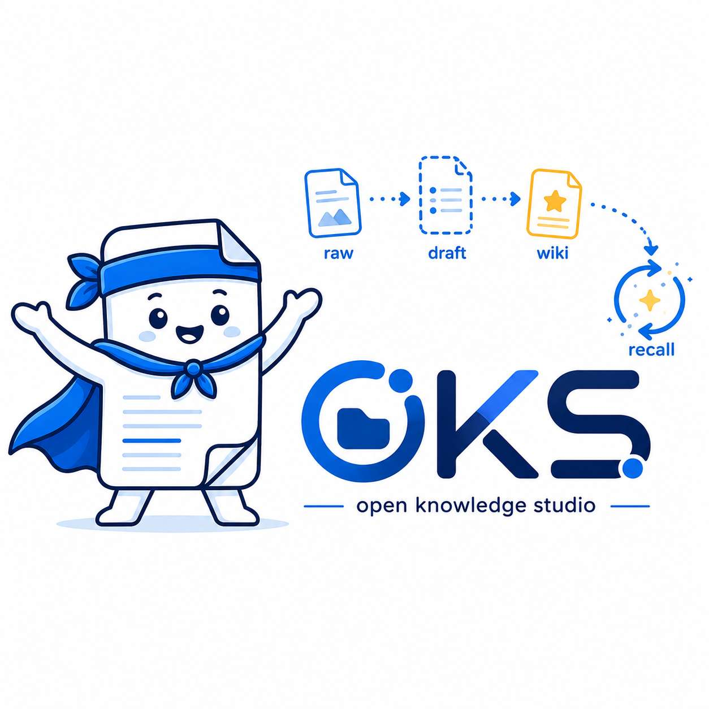

# Open Knowledge Studio

> **v0.4 Beta Final Engineering Closure** — 5 gates passed, 555 tests, 0 regressions.

A file-based knowledge workspace for Claude Code and compatible Agents.
OKS helps Agents turn sources into reviewed, traceable and recallable knowledge.

[English](#english) | [中文](#chinese)

---

<a id="english"></a>

## English

### What is this?

Open Knowledge Studio is a lightweight knowledge engineering workspace for AI Agents.

It gives Agents a stable file-based memory layer: project knowledge, source
evidence, failure lessons and human decisions survive across sessions instead of
being re-explained every time.

### Recommended Workflow

The **only** recommended path (v0.4.0+):

```text
Agent reads Source
  → selects Capability / Provider
  → produces EvidenceManifest
  → oks raw-commit
  → Raw Bundle
  → AgentObservation → Candidate
  → Human Review (mandatory gate)
  → Wiki
  → Search / Recall → Agent Output
```

Agents may write Candidates. Humans approve Wiki. Core never calls AI APIs.
Provider never writes Raw directly. Recipe never hardcodes a specific Provider.

### Quick Start

Requirements: Python ≥ 3.12, Git, pipx.

```bash
# Install the latest canonical main branch
pipx install open-knowledge-studio
oks --version

# Create a workspace (this also installs the Agent skills into it)
oks init ./my-knowledge-base
export OKS_ROOT=./my-knowledge-base
```

**Ingesting a source**: in a supported Agent Host (Claude Code, Codex), just say:

> 收录这个 PDF

The Agent reads the `/ingest` skill, checks capabilities, selects Providers,
collects evidence, runs `oks raw-commit`, and writes a Candidate to `drafts/`.

**Pure terminal** (no Agent): `oks ingest <source>` creates a Run Workspace and
outputs instructions for Agent continuation. It does not invoke an Agent on its
own.

After human review:

```bash
oks drafts promote <slug>
oks recall "how should agent memory be managed?"
oks lint
```

### Core CLI

```text
oks init             Create knowledge workspace
oks raw-commit       Commit evidence bundle to Raw (Fragment ↔ Manifest consistency enforced)
oks capability       List / doctor / status available Providers (incl. user_impact metadata)
oks config           Manage global config — including strategy (lightweight/quality/privacy/ask_each_time)
oks drafts           Manage Candidate drafts
oks wiki             Manage reviewed knowledge pages
oks recall           Two-path episodic + knowledge recall (--knowledge-only, --type)
oks feishu           Feishu pull-mode entry (oks feishu pending) + review workflow
oks lint             Quality scan
oks status           Overview dashboard
```

### What's New in v0.4 Beta

| Feature | Description |
|---------|-------------|
| **Fragment ↔ Manifest consistency** | 4 core fields validated (artifact_id, kind, method, agent_judgment); fail-closed on mismatch |
| **ASR transcript semantics** | `kind=transcript` + `method=asr_transcription` now accepted by schema |
| **Guided Decision UX** | Strategy config (`oks config set strategy`); 11 providers carry `user_impact` metadata; Strategy-Aware Ingestion in skill templates |
| **Feishu Pull Mode** | `oks feishu pending` — zero daemon, zero WebSocket, zero background process |
| **17 Providers** | 25 capability actions, 7 modality recipes; provider.yaml + SKILL.md per provider |

**555 tests passed** (1 pre-existing env failure, 0 regressions).

### Optional Capabilities

OKS keeps the core lightweight. Heavy capabilities are installed on demand.

| Capability | Purpose |
|---|---|
| `document` | Office (docx/pptx/xlsx), HTML, CSV |
| `pdf-lite` | Lightweight text-layer PDF extraction (pymupdf4llm) |
| `pdf` | Full PDF extraction (MinerU, ~300 MB) |
| `watch` | Video, audio, subtitle and OCR extraction |
| `formula` | PaddleOCR formula candidates |
| `feishu` | Feishu Base / form / review workflow |

### Agent Philosophy

OKS is Claude Code-first, but not Claude Code-only. It works with any Agent
that can read files, run commands and follow project rules.

Do not build a new platform when existing Agent capabilities already do the job.

### Documentation

* [Core Architecture](docs/architecture/oks-core-architecture.md)
* [Capability Boundaries](docs/capability-boundaries.md)
* [Agent-Native Ingest Walkthrough](docs/ingest/agent-native-ingest-walkthrough.md)
* [Kimi K3 Deep Analysis](docs/cases/kimi-k3-deep-analysis.md)
* [Security — Remote Governance](docs/security/remote-governance.md)

### Migration from v0.3.x

In v0.4.0 the legacy extractor pipeline was removed:

- `--legacy` flag — removed
- `OKS_ENABLE_LEGACY_PROVIDERS` env var — removed
- `raw_bundle_adapter.py`, `source_router.py`, old extractors — permanently deleted
- `oks ingest <source> --mode quick` — replaced by Agent-native `/ingest` skill

Legacy code is preserved in Git tag `v0.4.0-legacy-final`.

### License

MIT

---

<a id="chinese"></a>

## 中文

> **v0.4 Beta 最终工程收口** — 5 个验证 Gate 全部通过，555 项测试，0 回归。

Open Knowledge Studio 是一个面向 Claude Code 和兼容 Agent 的文件式知识工作区。

它让 Agent 把外部资料、项目经验、失败教训和人工判断沉淀成可追溯、可审核、可召回的长期知识，
而不是每次新会话都重新解释上下文。OKS 不试图替代 Obsidian、Notion、Roam 或用户已有的编辑器——它负责的是：把用户已有的文件、网页、媒体、平台内容，经 Agent 提取、人工审核后，沉淀成可召回的文件系统知识。

### 推荐主链（v0.4.0 起唯一路径）

```text
Agent 读取 Source
  → 选择 Capability / Provider
  → 生成 EvidenceManifest
  → oks raw-commit
  → Raw Bundle
  → AgentObservation → Candidate
  → Human Review（强制人工门禁）
  → Wiki
  → Search / Recall → Agent Output
```

Agent 可以写 Candidate。人工审核后进入 Wiki。Core 不调用 AI API。
Provider 不直接写 Raw。Recipe 不写死具体 Provider。

### 快速开始

```bash
pipx install open-knowledge-studio
oks --version

# oks init 会同时把 Agent 技能装进该目录
oks init ./my-knowledge-base
export OKS_ROOT=./my-knowledge-base
```

**收录来源**：在支持的 Agent Host（Claude Code / Codex）中说：

> 收录这个 PDF

Agent 读取 `/ingest` Skill、检查能力、选择 Provider、采集证据、执行
`oks raw-commit`，最后将 Candidate 写入 `drafts/`。

**纯终端**（无 Agent）：`oks ingest <source>` 创建 Run Workspace 并输出 Agent
接管提示，不自行调用 Agent。

人工批准后：

```bash
oks drafts promote <slug>
oks recall "how should agent memory be managed?"
oks lint
```

### 从 v0.3.x 迁移

v0.4.0 已移除旧 extractor 链路：

- `--legacy` 标志 — 已移除
- `OKS_ENABLE_LEGACY_PROVIDERS` 环境变量 — 已移除
- `raw_bundle_adapter.py`、`source_router.py`、旧 extractor — 已永久删除
- `oks ingest <source> --mode quick` — 由 Agent-native `/ingest` Skill 替代

旧代码保留在 Git tag `v0.4.0-legacy-final` 中。

### 详细文档

* [核心架构](docs/architecture/oks-core-architecture.md)
* [能力边界](docs/capability-boundaries.md)
* [Agent-Native Ingest 操作手册](docs/ingest/agent-native-ingest-walkthrough.md)
* [Kimi K3 深度分析](docs/cases/kimi-k3-deep-analysis.md)
* [安全 — 远程脱敏治理](docs/security/remote-governance.md)
