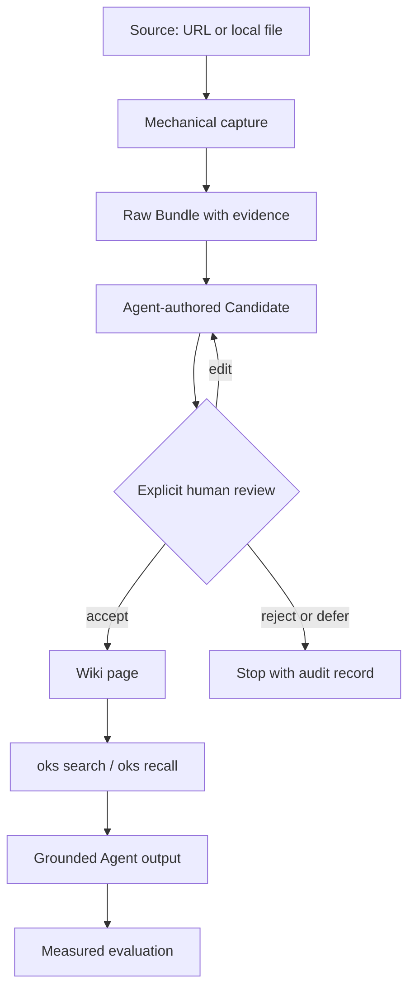
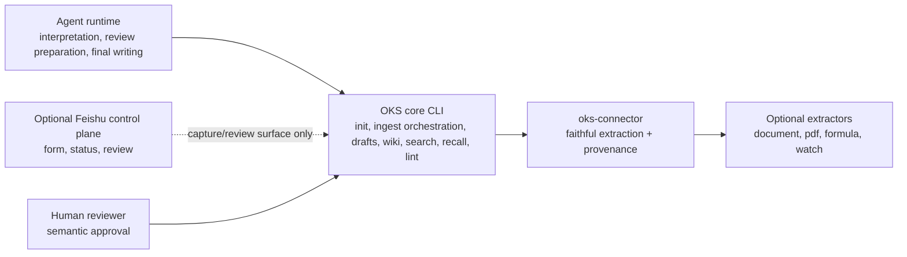

# OKS Core Architecture

Date: 2026-07-29

This page is the current source of truth for the validated core loop. It
intentionally separates the product core from optional capture surfaces such as
Feishu.

## Validated Core Loop

The core claim is not that OKS can extract every media type today. The core
claim is that knowledge can move through a traceable lifecycle:

`Source -> Raw -> Candidate -> human review -> Wiki -> Recall -> output -> evaluation`

## Component Boundary

Feishu is not the learning loop. It is an optional private control plane for
capture, status, and review. A user without Feishu must still be able to run
the CLI path. A user with Feishu can route submissions and review decisions into
the same lifecycle.

## Current Evidence

The book POC in `docs/acceptance/book-poc-report.md` validates the minimal
loop on a public-domain text source:

- isolated KB initialization;
- Raw Bundle generation and validation;
- Agent Candidate creation;
- explicit user approval;
- Wiki promotion;
- `oks search`, `oks recall`, and `oks lint`;
- A/B model comparison using the approved Wiki context.

The result is `completed_with_findings`: the lifecycle works, and the OKS Wiki
materially improved answer correctness. The strict traceability threshold was
not fully met because the generated B answer did not repeat section/line
locators in each answer.

## Capability Boundary

OKS should do:

- preserve source, Raw, Candidate, review, Wiki, recall, and evaluation states;
- keep optional extractors installable on demand;
- distinguish product failure, environment limitation, partial success, and
  skipped work;
- require human approval before Wiki promotion;
- make recalled evidence easy for an Agent to cite.

OKS should not do:

- replace browser, model, OCR, ASR, or document extraction ecosystems;
- treat Feishu as mandatory infrastructure;
- silently promote Raw into Wiki;
- hide missing tools, failed downloads, anti-bot blocks, or model limitations;
- claim a complete media platform before each capability has independent
  evidence.

## Immediate Architecture Fix

The next narrow improvement is output traceability. Agent-facing prompts and
tutorials should require every final answer to carry the locator already
present in the Wiki or Recall context. This is a prompt/template fix before it
is an infrastructure change.
