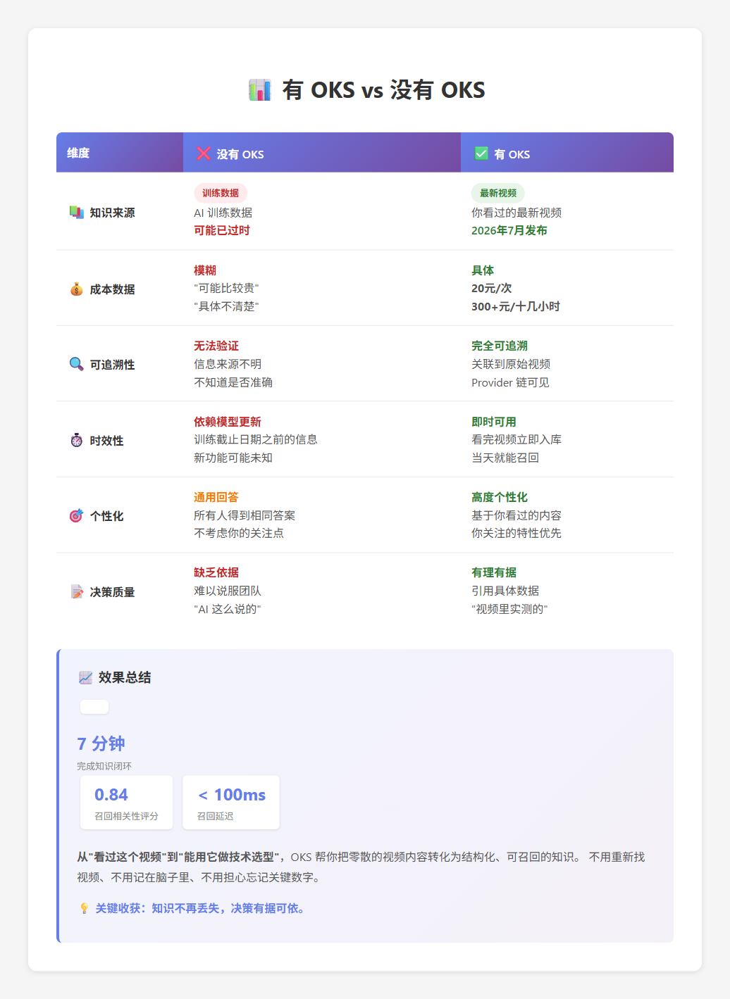

# OKS 最佳实践

> 三个阶段，三个核心原则

**快速理解**：OKS 把你**真正看过的资料**，变成**未来能找到的知识**。

---

## 快速导航

- [三个阶段](#三个阶段)
- [完整案例：7 分钟见效](#完整案例7-分钟见效)
- [常见工作流](#常见工作流)
- [快速问答](#快速问答)

---

## 三个阶段

### 阶段 1：收集 Raw - 只收你真正看过的

| ✅ 应该收集 | ❌ 不要收集 |
|-----------|-----------|
| 看完的视频、文章、书 | 没看过的"收藏链接" |
| 包含具体数据的资料 | 纯娱乐内容 |
| 需要追溯来源的信息 | 敏感信息（密码、密钥） |

**💡 A/B/C 分级**：
- **A 级**（核心）：必审必晋升
- **B 级**（有用）：选择性晋升
- **C 级**（参考）：只保留 Raw

> **下一步**：[如何入库资料](first-knowledge-loop.md#1-交给-agent)

---

### 阶段 2：沉淀 Wiki - 三个检查点

**审核 Draft 时检查**：
1. **准确性**：事实是否正确？有没有 AI 幻觉？
2. **可复用**：三个月后还能用吗？
3. **可追溯**：能找回原始资料吗？

**常见错误**：
- ❌ 不审核直接晋升
- ❌ Draft 堆积超过 20 个
- ❌ 晋升后不测试召回

**快速判断**："三个月后我会用到吗？如果用到，这个 Draft 够用吗？"

> **下一步**：[审核 Candidate](review-candidates.md)

---

### 阶段 3：召回 Recall - 用自然语言提问

| ✅ 好的提问 | ❌ 不好的提问 |
|-----------|-------------|
| "Kimi K3 适合用来做文档分析吗？" | "Kimi K3 文档 成本" |
| "我要设计XX系统，需要YY" | 关键词堆砌 |

**召回不准？三个检查**：
1. Draft 已晋升？→ `oks wiki list`
2. 用词匹配？→ 换个措辞
3. 类型权重？→ `generic` 被降权，改为 `concept`

**调优技巧**：
- 用 `--explain` 查看评分详情
- 设置 goal 提升相关领域权重
- 用 `oks wiki use <slug>` 标记使用

> **技术细节**：[Triple-Layer Recall](algorithms/recall-engine.md) - R@1=82.5%

---

## 完整案例：7 分钟见效

### 真实演示：B 站 Kimi 视频 → 技术方案

**时间线**：
```
1. 看视频（5 分钟）
2. 入库（30 秒，自动）
3. 审核 Draft（1 分钟）
4. 召回使用（瞬间）
```

**关键数据**：
- 召回相关性：**0.84**
- 成本分析：20元/次 → **60,000元/月**
- 技术方案：基于召回知识，有理有据

👉 **[查看完整演示（配截图）](../examples/oh-my-research/demo/kimi-video-walkthrough.md)**



**核心收获**：从"看过这个视频"到"能用它做技术选型"，只需 7 分钟。

---

## 常见工作流

### 日常学习
```
看文章/视频 → 周末集中审核 → 写方案时自动召回
```
**技巧**：平时只收集不审核，降低心理负担

### 技术选型
```
收集 3 个方案 → 沉淀核心特性 → 召回对比 → 决策
```
**技巧**：用统一结构记录（成本、性能、场景）

### 项目维护
```
重要决策 → 收录 OKS → 踩坑补充 → 新人召回
```
**技巧**：用 `supersedes` 更新过时决策

> **更多场景**：[托管你的 GitHub](../examples/oh-my-github/) · [托管你的飞书](../examples/oh-my-feishu/)

---

## 快速问答

### Q: 为什么召回找不到？
**A**: 1. 检查是否晋升 `oks wiki list` 2. 换个措辞 3. 用 `--explain` 看详情

### Q: Draft 太多怎么办？
**A**: A/B/C 分级，批量 reject 不需要的，每周固定时间审核

### Q: 成本和性能？
**A**: 50个 Wiki < 100ms，视频转写免费（本地 faster-whisper）

### Q: 适合团队用吗？
**A**: OKS 是个人工具。团队可以各自维护 + 定期同步高价值 Wiki

> **更多问题**：[故障排除](reference/troubleshooting.md)

---

## 延伸阅读

**核心概念**：
- [三个决策点的深入解释](concepts/philosophy.md)
- [知识 vs 资料的区别](concepts/memory-model.md)
- [为什么是文件系统](concepts/file-system-paradigm.md)

**算法细节**：
- [Triple-Layer Recall](algorithms/recall-engine.md) - Node-BM25 + Soul Boost + Memory Curve
- [召回评估](algorithms/recall-evaluation.md) - 50-case 消融实验

**使用指南**：
- [完成第一个知识闭环](first-knowledge-loop.md)
- [上下文注入机制](usage/context-injection.md)
- [CLI 命令参考](reference/cli.md)

---

**最后提醒**：时间花在阅读和理解上，不是收集和整理上。
