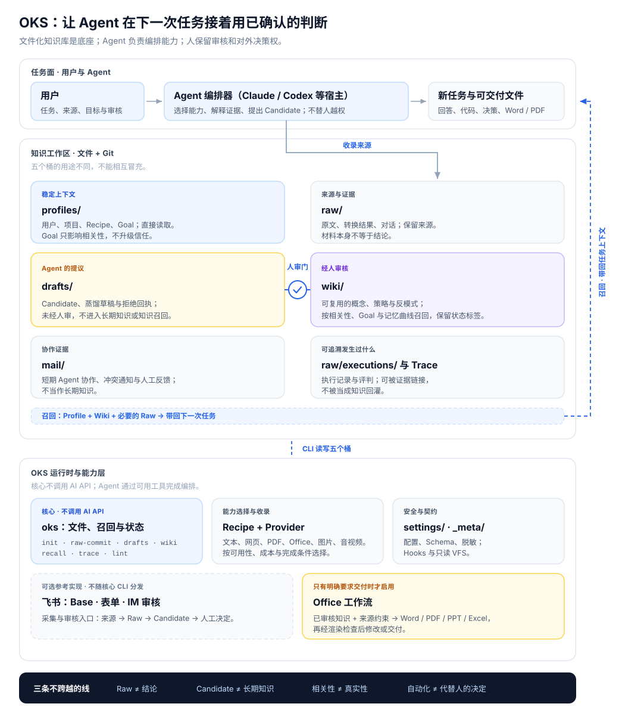

# 架构总览

如果你只是使用 OKS，只需要先理解这一件事：**来源先被保留，Agent 只能提出候选，人审核后才会成为下一次任务可以使用的知识。**

## 怎样读这张图

1. **来源与 Raw**：文章、文件、视频或对话先作为材料保存。提取完成不代表其中的主张已经成立。
2. **Candidate**：Agent 从材料中提出“哪些内容值得留下”，同时标出来源和证据缺口。
3. **人工审核**：人接受、修改或拒绝 Candidate。这是唯一让内容进入长期知识的门。
4. **Wiki 与召回**：新任务只复用已审核内容；当证据不足时，正确结果是说明不足，而不是编出确定答案。

## 需要深入时

这张图刻意没有塞进协议名、索引算法或内部目录。它们仍然存在，只是属于不同读者：

- 想收集不同类型的材料，阅读[收集来源](../usage/ingest.html)。
- 想理解审核和晋升，阅读[审核候选](../usage/review.html)。
- 想了解召回如何选择知识，阅读[召回与注入](../usage/recall.html)。
- 维护者需要完整文件桶、只读 VFS、Hooks 与可选飞书集成时，阅读[宪法（A1-A5）](constitution.html)和[参考手册](../reference/)。

## 架构边界

- **Raw 不等于 Wiki**：Raw 保留材料和机械提取；Wiki 是经人审核、能在后续任务中复用的知识。
- **VFS 不是新知识桶**：`oks://` 只提供受限的只读访问视图，不会绕开文件治理。
- **Hooks 和飞书是可选入口**：它们可以改变收集或反馈的位置，但不会取消人工审核。
- **信任来自证据和审核**：`[verified]` 只应来自 Trace 证据或 `human_reviewed_at`，而不是使用次数。
