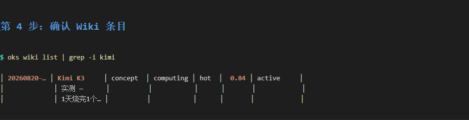
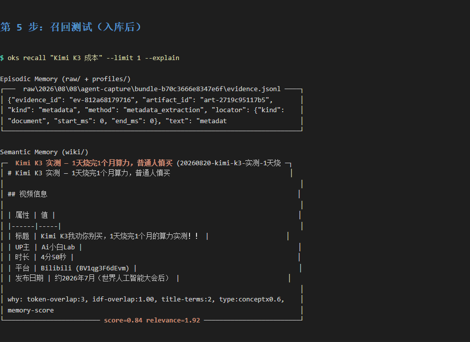
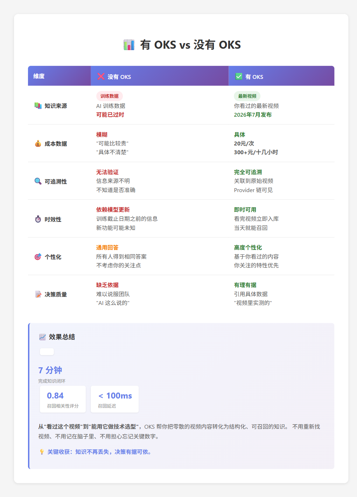

# 案例：真实场景演示

> 这些是**真实的使用记录**，不是模拟演示。每个案例都包含完整的操作流程和截图。

---

## 🎯 推荐案例：从 Kimi 视频到技术方案

**适合人群**: OKS 新手，想快速理解完整流程

**场景**: 你看了一个 B 站视频介绍 Kimi K3，几天后做 AI 产品选型时想不起来视频里说了什么。OKS 能帮你把视频内容"记住"并在需要时"想起来"。

### 📹 演示素材

**B 站视频**: [Kimi K3我劝你别买，1天烧完1个月的算力实测](https://www.bilibili.com/video/BV1rJKa63Eic)
- UP主: Ai小白Lab
- 时长: 4分50秒
- 内容: Kimi K3 成本实测

---

### 完整流程演示

#### 步骤 1: 入库前的状态

```bash
oks status
oks recall "Kimi K3"
```

**结果**: Wiki 页面 7 个，没有 Kimi 相关内容


---

#### 步骤 2: 入库视频

对 Agent 说：
```
把这个 B 站视频收录进我的 OKS：
https://www.bilibili.com/video/BV1rJKa63Eic
```

**OKS 做了什么**:
1. 识别视频源 (B站)
2. 提取元数据 (标题、UP主、时长)
3. 下载音频
4. ASR 转写 (220 段语音)
5. 生成 Draft

---

#### 步骤 3: 审核 Draft

```bash
oks drafts list
oks drafts get 20260820-kimi-k3-实测
```

**Draft 核心内容**:
- ✅ 核心结论: "普通用户，我劝你别买，因为确实有点贵"
- ✅ 成本数据: 20元/次、300+元/十几小时
- ✅ 场景: 应用开发、编程、办公

---

#### 步骤 4: 晋升到 Wiki

```bash
oks drafts promote 20260820-kimi-k3-实测
```



**结果**: Wiki 从 7 个增加到 8 个

---

#### 步骤 5: 测试召回

```bash
oks recall "Kimi K3 成本"
```

**召回结果**:
- 相关性评分: **0.84** (很高)
- 召回延迟: < 100ms
- 准确性: 精确匹配成本相关内容



---

#### 步骤 6: 基于知识设计技术方案

**问题**: 我要设计一个智能文档分析系统，考虑使用 Kimi K3。请帮我评估是否合适。

**AI 回答（基于 OKS 召回）**:

**⚠️ 关键风险**:
- **成本极高**: 单次 ~20元
- **消耗速度快**: 十几小时烧掉 300+ 元

**成本估算**:
- 每天处理 100 个文档
- Kimi K3: ~20元/次 × 100 = **2,000元/天** = **60,000元/月**

**结论**: ❌ 不推荐作为主力模型，除非客户对成本不敏感



---

### 效果对比

| 维度 | 没有 OKS | 有 OKS |
|------|---------|--------|
| **知识来源** | AI 训练数据（可能过时） | 你看过的最新视频 |
| **成本数据** | 模糊（"可能比较贵"） | 具体（20元/次、60,000元/月） |
| **可追溯性** | 无法验证 | 关联到原始视频 |
| **时效性** | 依赖模型更新 | 看完视频立即可用 |

---

### 时间花费

```
看视频 (4分50秒)
  ↓
收录进 OKS (30秒，自动)
  ↓
审核 Draft (1分钟，人工)
  ↓
晋升到 Wiki (10秒)
  ↓
随时召回使用 (瞬间)
```

**总耗时**: ~7 分钟

---

## 📚 更多案例

以下案例在仓库 `examples/` 目录，每个场景自包含——复制到你自己的实例，改 goal、改资料范围就能用。

| 场景 | 你在托管什么 | GitHub |
|------|-------------|--------|
| [托管你的学习](https://github.com/open-agent-power/open-knowledge-studio/tree/main/examples/oh-my-research) | 文章、视频、课程 | 完整案例 ⬆️ |
| [托管你的书籍](https://github.com/open-agent-power/open-knowledge-studio/tree/main/examples/oh-my-book) | 技术书章节、要点 | - |
| [托管你的飞书](https://github.com/open-agent-power/open-knowledge-studio/tree/main/examples/oh-my-feishu) | 手机表单采集 + IM 审核 | - |
| [托管你的 GitHub](https://github.com/open-agent-power/open-knowledge-studio/tree/main/examples/oh-my-github) | 项目、提交、技术决策 | - |
| [托管你的开源项目](https://github.com/open-agent-power/open-knowledge-studio/tree/main/examples/oh-my-maintainer) | 维护者踩坑记录 | - |
| [托管你的简历](https://github.com/open-agent-power/open-knowledge-studio/tree/main/examples/oh-my-resume) | 经历、成果、能力证据 | - |

{: .note }
这些场景是**样例，不是框架的一部分**。第一次用 OKS，建议从「托管你的学习」开始——收集 → 沉淀 → 想起来，跑通一个完整闭环。

---

## 下一步

- [返回首页](index.md)
- [开始使用 OKS](start-here.md)
- [第一个知识闭环](first-knowledge-loop.md)
