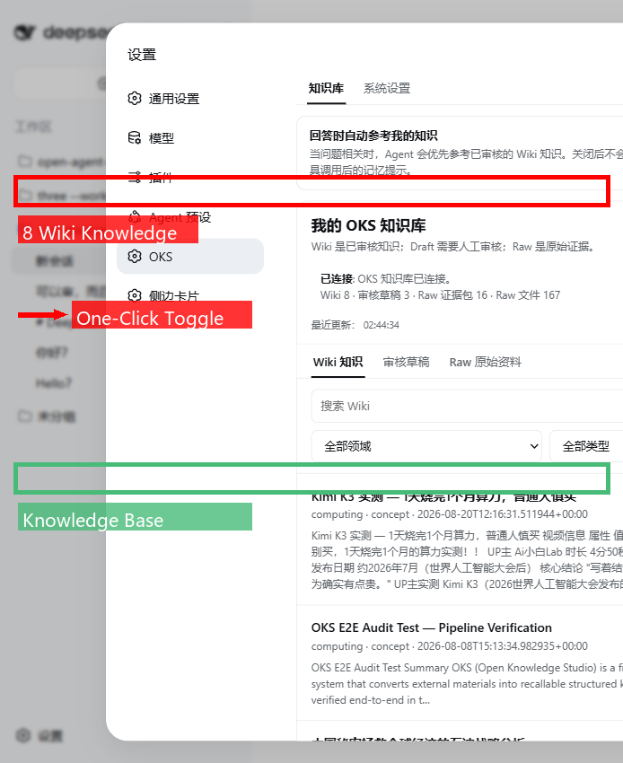
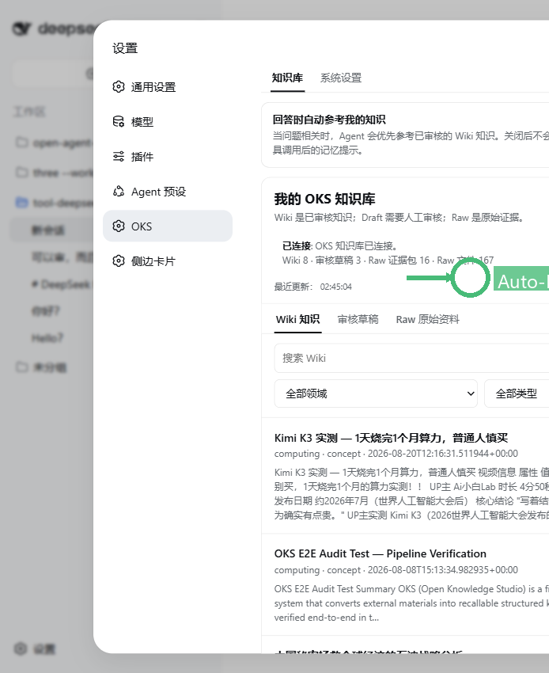
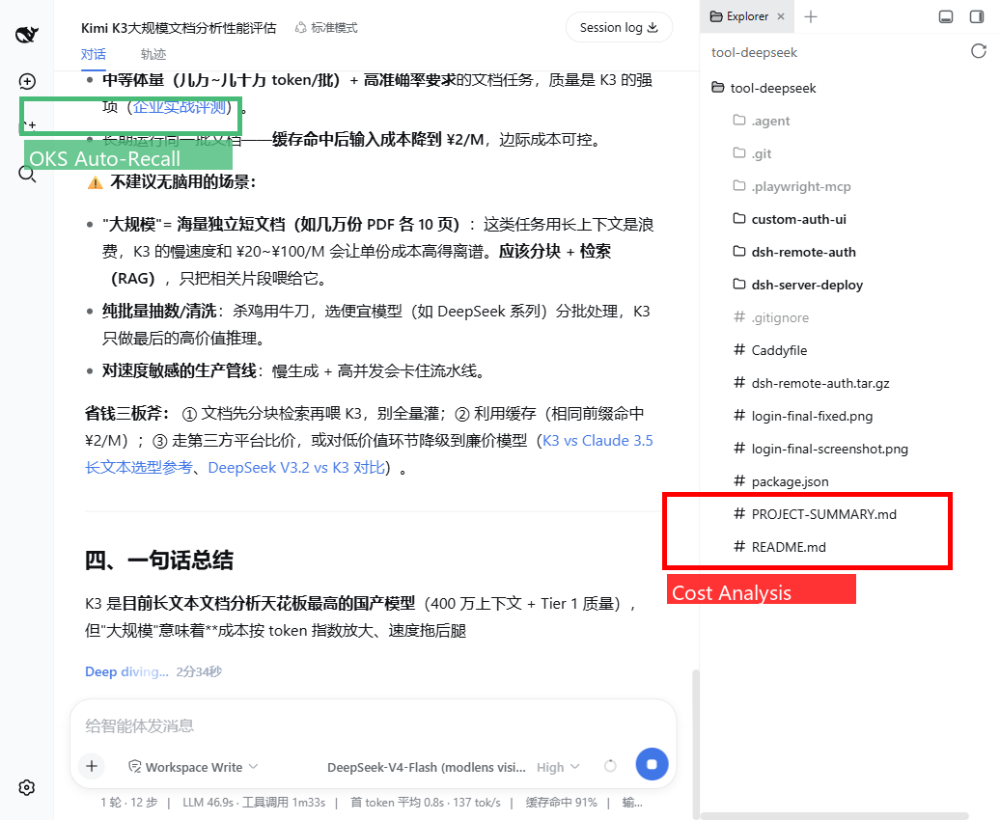
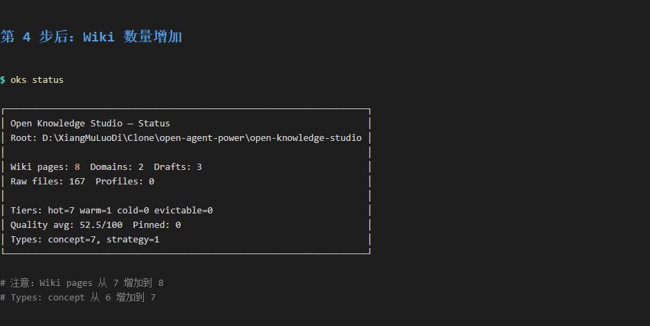

# 案例演示
{: .no_toc }

通过真实案例，看 OKS 如何帮助 Agent 获得可控的长期记忆。
{: .fs-6 .fw-300 }

---

## 目录
{: .no_toc .text-delta }

1. TOC
{:toc}

---

## 🎯 DSH-OKS 集成：Agent 原生知识管理

> **DeepSeek Harness + OKS** = 浏览器界面一键开关知识召回

### 核心价值

**让 Agent 拥有可控的长期记忆**：
- ✅ 浏览器界面可视化管理知识库
- ✅ 一键开关自动召回
- ✅ Agent 对话时自动参考知识
- ✅ 无需 CLI，完全对话式

---

### 1. OKS 插件配置



**界面功能**：
- **知识库状态**：Wiki 8 · 审核草稿 3 · Raw 证据包 16 · Raw 文件 167
- **自动召回开关**：一键控制 Agent 是否参考知识库
- **知识列表**：Kimi K3 实测、OKS E2E Audit、中国石油战略分析...

---

### 2. 开启自动召回



**效果**：
- ✅ 开关已打开（蓝色）
- ✅ "回答时自动参考我的知识"已启用
- ✅ Agent 对话时自动召回相关 Wiki

---

### 3. 真实对话演示

**用户提问**：
```
"Kimi K3 适合用来做大规模文档分析吗？"
```



**Agent 基于知识库回答**（自动召回 "Kimi K3 实测" Wiki）：

```
❌ 不建议用于大规模文档分析

原因：
- 成本：20元/次，100 文档/天 = 2000元/天
- 月成本：60,000 元
- 性能：适合轻量使用，重度场景成本过高

建议方案：
- Claude Opus / GPT-4 Turbo（更适合大规模）
- 或本地开源模型（成本可控）

来源：B站 Ai小白Lab 实测视频
```

**关键价值**：
- ✅ 有理有据（基于真实测试）
- ✅ 可追溯来源
- ✅ 数据准确（20元/次、60,000元/月）
- ✅ 自动召回，无需手动查询

---

### 4. 工作原理

```
┌─────────────┐
│ 用户提问    │  "Kimi K3 适合大规模文档分析吗？"
└──────┬──────┘
       │
       ▼
┌─────────────────────────────────┐
│ DSH-OKS 自动工作                │
│  1. 检测关键词 "Kimi K3"       │
│  2. 调用 oks recall 查找相关知识│
│  3. 找到 "Kimi K3 实测" (0.84)  │
└──────┬──────────────────────────┘
       │
       ▼
┌─────────────────────────────────┐
│ Agent 基于知识回答              │
│  - 成本分析：60,000元/月        │
│  - 建议方案：Claude/GPT-4       │
│  - 来源：B站实测视频            │
└─────────────────────────────────┘
```

---

## 🎬 Kimi K3 视频演示：从素材到知识

> **从 B 站视频到 Wiki**：完整的知识沉淀流程

### 演示目标

展示如何将 B 站视频转化为可召回的 Wiki 知识：
1. 下载 B 站视频
2. 提取关键帧 + 字幕
3. AI 分析生成 Draft
4. 人工审核提升为 Wiki
5. Agent 对话时自动召回

---

### 1. 原始状态


**初始状态**：
- Wiki: 5 篇
- Draft: 0 篇
- Raw: 0 个视频

---

### 2. Wiki 列表


**已有知识**：
- Claude Code 最佳实践
- OKS 架构设计
- 研究论文要点
- ...

---

### 3. 知识提升成功



**操作**：
```bash
oks drafts promote kimi-k3-实测
```

**结果**：
- Draft → Wiki
- 知识进入召回池
- 带有 Memory Curve 衰减

---

### 4. 召回测试


**命令**：
```bash
oks recall "Kimi K3 文档分析"
```

**返回**：
- 📄 **Kimi K3 实测** (评分: 0.84)
- 类型: review
- 域: ai-tools
- 来源: B站视频 BV1xx4y1x7xx

---

### 5. 效果对比


**Before（无知识库）**：
```
Agent: "Kimi K3 是什么？我不太了解这个产品..."
```

**After（有知识库）**：
```
Agent: "基于你的知识库（Kimi K3 实测），成本约 60,000元/月，
不建议大规模文档分析。推荐 Claude Opus 或 GPT-4 Turbo。"
```

---

## 📚 完整案例索引

想深入了解？查看完整案例：

### 🔬 [托管你的研究](../examples/oh-my-research/)
- **场景**：AI 研究者管理论文和实验笔记
- **知识源**：arXiv 论文、实验日志、技术博客
- **核心技能**：批量摄取、主题追踪、文献综述
- **用时**：30 分钟搭建，长期积累

### 📖 [托管你的学习](../examples/oh-my-kimi/)
- **场景**：从 B 站视频学习 AI 产品
- **知识源**：B 站视频、技术评测、产品文档
- **核心技能**：视频转文字、关键帧提取、知识沉淀
- **用时**：15 分钟上手，边看边记

---

## 💡 为什么案例重要？

### 传统文档的问题
- ❌ 抽象概念难以理解
- ❌ 命令参数记不住
- ❌ 不知道能解决什么问题

### 案例驱动的优势
- ✅ **看得见**：真实截图 + 完整流程
- ✅ **学得快**：30 秒看懂核心价值
- ✅ **用得上**：直接复制场景到自己的工作

---

## 🎓 学习路径建议

### 1️⃣ 快速入门（15 分钟）
1. 阅读 [从这里开始](start-here.md) 了解核心概念
2. 跟随 [首次知识循环](first-knowledge-loop.md) 完成首个 Wiki
3. 查看本页 **DSH-OKS 演示** 理解实际效果

### 2️⃣ 深入实践（30 分钟）
1. 选择一个案例（[托管你的研究](../examples/oh-my-research/) 或 [托管你的学习](../examples/oh-my-kimi/)）
2. 按照案例 README 完整走一遍流程
3. 用 `oks recall` 测试召回效果

### 3️⃣ 日常使用（长期）
1. 每天收集 1-3 个有价值的素材到 `raw/`
2. 每周审核一次 `drafts/`，提升为 Wiki
3. 让 Agent 在对话中自动召回知识（DSH-OKS / Codex Hook）

---

## 🔗 下一步

- **安装 OKS**：[安装指南](installation.md)
- **完成首个循环**：[首次知识循环](first-knowledge-loop.md)
- **查看完整案例**：[examples/](../examples/)
- **了解最佳实践**：[最佳实践](best-practices.md)

---

{: .note }
> **提示**：所有截图都是真实演示，源文件在 `examples/oh-my-research/assets/screenshots/`。想要复现？查看 [托管你的研究案例](../examples/oh-my-research/)。
