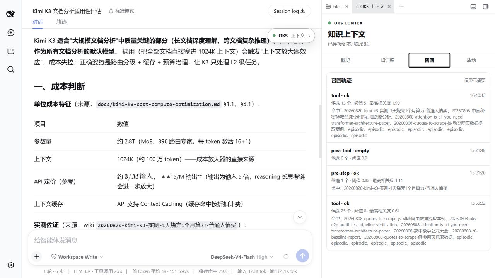

# 案例演示
{: .no_toc }

通过真实页面和可复现步骤，看 OKS 如何让 Agent 使用一套可审核、可追溯的长期知识。
{: .fs-6 .fw-300 }

---

## 目录
{: .no_toc .text-delta }

1. TOC
{:toc}

---

## 🎯 DSH-OKS 集成：Agent 原生知识管理

> **DeepSeek Harness + OKS** = 在当前对话旁边查看知识库、召回轨迹和来源。

### 核心价值

**让 Agent 拥有可控的长期记忆**：
- ✅ 浏览器界面可视化管理知识库
- ✅ 一键开关自动召回
- ✅ Agent 对话时自动参考知识
- ✅ 日常使用以对话为主，CLI 保留给初始化、调试和脚本集成

---

### 1. OKS 插件配置


**截图说明**：这是一次真实 Harness 会话中的知识库快照；数字是该演示实例的当前数量，不代表所有安装都相同。

**可以看到**：
- **知识库状态**：Wiki 8 · 审核草稿 3 · Raw 证据包 16 · Raw 文件 167
- **自动召回开关**：一键控制 Agent 是否参考知识库
- **知识列表**：Kimi K3 实测、OKS E2E Audit、中国石油战略分析...

---

### 2. 开启自动召回


**效果**：
- ✅ 开关已打开
- ✅ "回答时自动参考我的知识"已启用
- ✅ Agent 对话时自动召回相关 Wiki

---

### 3. 真实对话演示

**用户提问**：
```
"Kimi K3 适合用来做大规模文档分析吗？"
```


**这张截图展示的结论**：Kimi K3 适合质量关键的长文档理解和复杂推理，但不应默认处理所有文档；更稳妥的方案是路由分级、缓存、压缩和预算治理。

**证据边界**：单次约 20 元来自 Wiki 记录的实测，不是统一 API 价格；成本表中的价格和降幅是技术文档中的参考模型，使用前应以官方计费页和自己的输入输出量复核。

**关键价值**：
- ✅ 有理有据（基于真实测试）
- ✅ 可追溯来源
- ✅ 实测、估算和判断分开标注
- ✅ 自动召回，无需手动查询

---

### 4. 工作原理


这条链路的关键门槛是 **人工审核**：Raw 只保存原始材料，Candidate 只是提案，只有审核后的 Wiki 才会进入长期召回。

---

## 🎬 Kimi K3：从素材到知识

> **从 B 站视频到 Wiki**：完整的知识沉淀流程

### 演示目标

展示一条可复现的 B 站视频入库路径。下面的数量和耗时取决于实例与素材，不把某次演示的状态写成固定承诺：
1. 获取视频或可用字幕
2. 提取可读文本与关键证据
3. AI 分析生成 Draft
4. 人工审核提升为 Wiki
5. Agent 对话时自动召回

---

### 1. 保存原始资料

把视频交给 `/ingest`，让 Agent 先保存 Raw 和证据，不要直接写入 Wiki：

```text
请把这个视频作为原始资料收录到 OKS，并保留来源、转写和提取状态：
https://www.bilibili.com/video/BV1qg3F6dEvm
```

### 2. 审核并提升

**操作**：
```bash
oks drafts promote <draft-slug>
```

**结果**：
- Draft → Wiki
- 知识进入召回池
- 带有 Memory Curve 衰减

---

### 3. 召回测试



**命令**：
```bash
oks recall "Kimi K3 文档分析"
```

**返回内容会随知识库状态变化**，至少应能看到命中的 Wiki 标题、相关性和来源路径；不要把某一次分数复制成固定 SLA。

---

### 4. 对话中使用

**Before（无知识库）**：
```
Agent: "Kimi K3 是什么？我不太了解这个产品..."
```

**After（有知识库）**：
```
Agent: "基于你的知识库，K3 更适合质量关键的复杂任务；
批量、重复和低风险任务应优先走更便宜的模型，并设置预算墙。"
```

---

## 📚 完整案例索引

想深入了解？查看完整案例：

### 🔬 [托管你的学习](../examples/oh-my-research/)
- **场景**：把文章、课程和视频变成可召回的学习知识
- **知识源**：技术文章、课程笔记、视频转写
- **核心技能**：逐条摄取、人工审核、主题追踪
- **用时**：按素材长度和审核深度而定

### 📖 [Kimi 产品学习案例](../examples/oh-my-kimi/)
- **场景**：从 B 站视频学习 AI 产品
- **知识源**：B 站视频、技术评测、产品文档
- **核心技能**：视频转文字、关键帧提取、知识沉淀
- **用时**：按素材长度和审核深度而定

---

## 💡 为什么案例重要？

### 传统文档的问题
- ❌ 抽象概念难以理解
- ❌ 命令参数记不住
- ❌ 不知道能解决什么问题

### 案例驱动的优势
- ✅ **看得见**：真实截图 + 完整流程
- ✅ **学得快**：30 秒看懂核心价值
- ✅ **用得上**：直接复制场景到自己的工作

---

## 🎓 学习路径建议

### 1️⃣ 快速入门（15 分钟）
1. 阅读 [从这里开始](start-here.md) 了解核心概念
2. 跟随 [首次知识循环](first-knowledge-loop.md) 完成首个 Wiki
3. 查看本页 **DSH-OKS 演示** 理解实际效果

### 2️⃣ 深入实践（30 分钟）
1. 选择一个案例（[托管你的学习](../examples/oh-my-research/) 或 [Kimi 产品学习](../examples/oh-my-kimi/)）
2. 按照案例 README 完整走一遍流程
3. 用 `oks recall` 测试召回效果

### 3️⃣ 日常使用（长期）
1. 每天收集 1-3 个有价值的素材到 `raw/`
2. 每周审核一次 `drafts/`，提升为 Wiki
3. 让 Agent 在对话中自动召回知识（DSH-OKS / Codex Hook）

---

## 🔗 下一步

- **安装 OKS**：[安装指南](installation.md)
- **完成首个循环**：[首次知识循环](first-knowledge-loop.md)
- **查看完整案例**：[examples/](../examples/)
- **了解最佳实践**：[最佳实践](best-practices.md)

---

{: .note }
> **提示**：本页展示图来自真实 Harness 会话，源文件在 `docs/assets/examples/`。想要复现？查看 [托管你的学习案例](../examples/oh-my-research/)。
