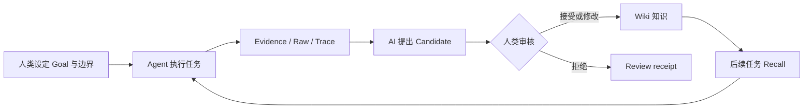

  
OPEN KNOWLEDGE STUDIO

  <h1>托管你的学习</h1>
  
把来源、执行轨迹、候选知识和人类反馈组织成一套可审核、可追溯、可持续召回的外部心智模型。

  

    <a class="btn btn-primary" href="{{ '/first-knowledge-loop.html' | relative_url }}">完成第一次学习循环</a>
    <a class="btn" href="{{ '/oh-my/study.html' | relative_url }}">查看 Oh My Study</a>
  

## Agent 为什么需要学习层

Agent 可以完成一次任务，却不会自然继承你在任务里形成的判断。会话结束、上下文压缩或执行者切换后，目标、证据、失败经验和取舍都可能丢失。

OKS 研究的问题是：

> Agent 如何在**人机协同**中持续学习，并保证**长任务执行**的稳定？

解决思路不是修改模型权重，而是构建一套文件化的“**知识即模型**”框架：人类持续提供目标和反馈，Agent 负责执行、整理和提出知识，OKS 保存证据、审核状态与召回路径。

## 人类判断，AI 执行

  

    <h3>人类负责边界</h3>
    
提出问题、设定 Goal、判断事实与价值、修改或拒绝 Candidate，并决定高风险动作是否继续。

  

  

    <h3>AI 负责工作</h3>
    
收集来源、保存证据、执行长任务、生成 Candidate、召回已审核知识，并暴露冲突和缺口。

  

  

    <h3>OKS 负责连续性</h3>
    
把 Raw、Draft、Wiki、Goal 和 Trace 连接起来，让下一次执行可以从已有判断继续。

  

## 一次可审计的学习循环

进入 Wiki 的知识必须经过人工审核。使用次数只能说明相关性，不能证明事实正确。

## 从哪里开始

1. [安装 OKS](installation.html)。
2. [完成第一个知识闭环](first-knowledge-loop.html)。
3. [确认 Recall 使用的是你的知识](verify.html)。
4. 再阅读 [Oh My Study](oh-my/study.html)，理解一个研究任务如何在反馈中演化。

## 产品边界

- `raw/` 保存来源与机械提取结果，不等于知识。
- AI 写入 `drafts/` 的内容只是 Candidate。
- 只有人工确认过的内容才能进入 `wiki/` 并获得已审核语义。
- OKS 核心不替人做事实判断，也不把失败包装成成功。
- “持续学习”指外部知识模型持续更新，不代表底座大模型权重被训练。

想直接操作，请从[第一次学习循环](first-knowledge-loop.html)开始；想理解设计，请阅读[知识即模型](concepts/philosophy.html)。
