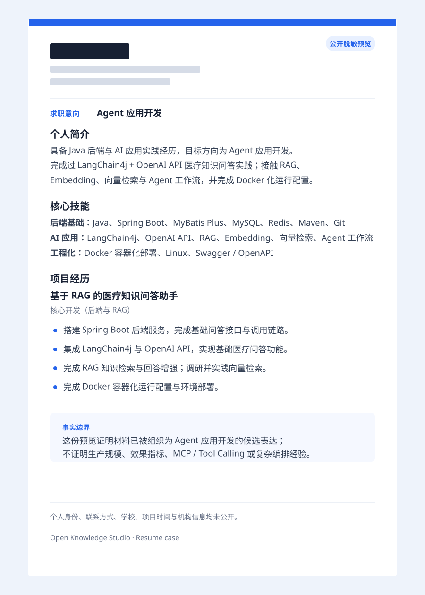

# 托管你的简历

{: .important }
> **这是一个 OKS 案例，不是一篇简历润色广告。** 用户给出一份真实 Word 简历和目标岗位；OKS 先保留材料事实，再生成可审核的候选表述，最后才用 Office 工作流产出一份岗位版 Word。姓名、联系方式、学校、机构与精确时间没有进入公开站点。

## 这次任务的知识闭环

```text
原始 Word 简历 + Agent 应用开发岗位要求
              ↓
提取已有事实与尚缺证据
              ↓
生成 Candidate，交给人逐条审核
              ↓
把已确认内容写入岗位版 Word
              ↓
下一次投递复用已确认的材料，不必重新解释背景
```

| 环节 | 这次案例里实际发生的事 |
| --- | --- |
| 输入 | 一份真实 Java 后端 / AI 应用学习实践简历，以及公开的 Agent 应用开发岗位要求。 |
| Agent 整理 | 找出 LangChain4j、OpenAI API、RAG、Embedding、向量检索、Docker 与后端项目这些已有材料。 |
| 人工决定 | 允许写“完成过实践 / 接触过”，不允许写“精通平台 / 已生产上线 / 有复杂多 Agent 经验”。 |
| 交付 | 一份私有的 Agent 应用开发版 Word；下方只展示脱敏的公开预览。 |

OKS 在这里保存的不是“这份简历排成了什么样”，而是：**哪些事实可复用、它们来自哪里、哪些能力仍缺证据。** 以后换到相近岗位，Agent 可以先召回这些已经确认的材料，再生成新的候选版本。

## Candidate：这次审核通过的表述

> **Agent 应用开发方向**：具备 Java / Spring Boot 后端基础，完成过基于 LangChain4j 与 OpenAI API 的医疗知识问答实践；接触 RAG、Embedding 与向量检索，并完成 Docker 化运行配置。希望继续在 Agent 工作流、知识库检索与 AI 应用工程化方向积累真实交付经验。

这段话来自已有 Word 中的项目与技能，而不是凭岗位关键词补出来的。它是本案例最重要的可复用结果：下一次要投递相近岗位，先从这个 Candidate 开始，而不是重新把简历全文交给 Agent 猜一遍。

## Office 交付：改好的 Word

审核通过后，OKS 使用已确认的 Candidate 与来源边界，生成岗位版 Word。原 Word 没有修改；新版本只改变求职意向、个人简介、技能组织和医疗知识问答项目的表达。

<figure class="case-figure">
  
  <figcaption>脱敏公开预览：它证明 OKS 的已审核 Candidate 被用于 Office 交付；不公开任何个人身份信息。</figcaption>
</figure>

## 这次材料能支持什么，不能支持什么

| 可以保留为知识 | 还不能写进简历的能力 |
| --- | --- |
| 医疗知识问答、RAG、Embedding、向量检索、模型 API 集成与 Docker 运行配置 | 线上效果、准确率、并发、成本与规模化运维 |
| Java、Spring Boot、MySQL、Redis、Swagger / OpenAPI 与 Git 基础 | 成熟 Agent 平台、复杂多 Agent 编排 |
| Agent 工作流实践与持续学习方向 | MCP / Tool Calling、评测、Trace、可观测的实际交付 |

这正是 OKS 的价值：它会把“已经确认的材料”和“下一步要补的证据”同时留下来，而不是为了让简历好看就把空白涂满。

## 下一次如何复用

例如下一次岗位更偏向知识库或 RAG，Agent 可以直接召回：医疗问答实践、RAG、Embedding、向量检索、Docker 和后端基础；若岗位明确要求 MCP、工具调用或评测，则把它们标成待补证据，而不是伪装成既有经验。

相关岗位要求可见 [Agent 开发工程师校招说明](https://www.shushuqiuzhi.com/position/435773) 与 [AI 应用方向岗位说明](https://zhaopin.jd.com/web/job-info-detail?requementId=220736)。
