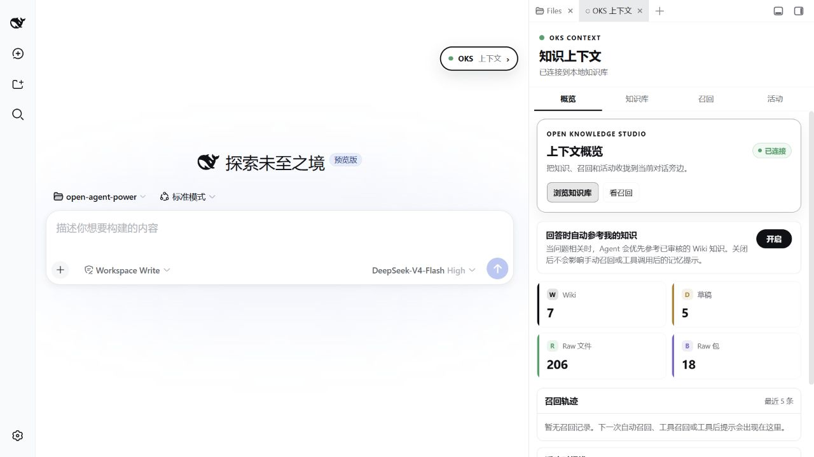
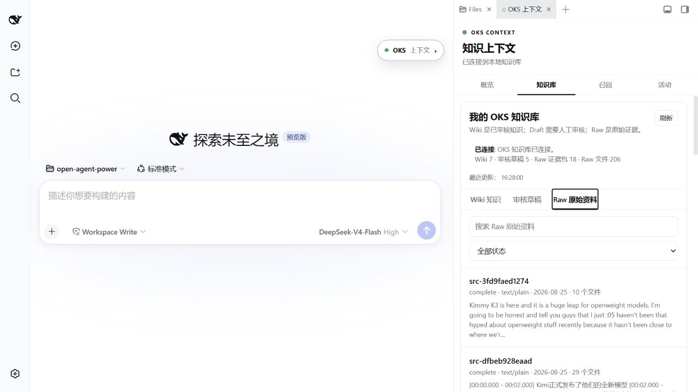
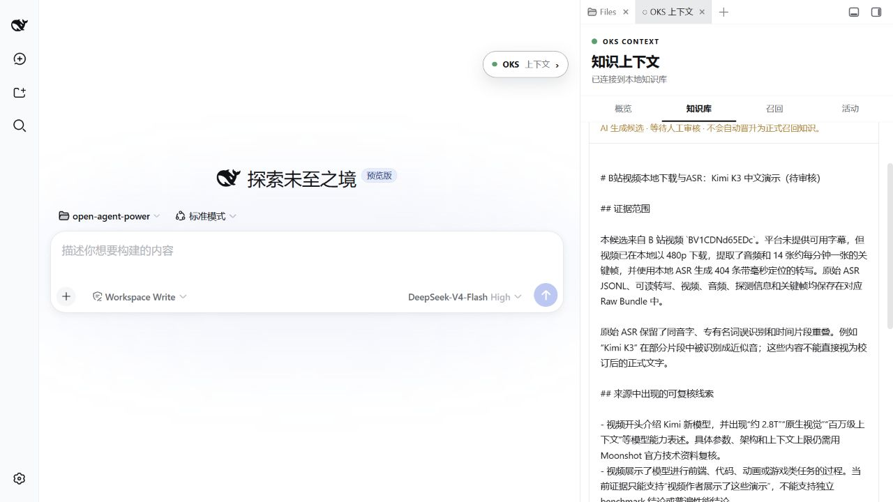
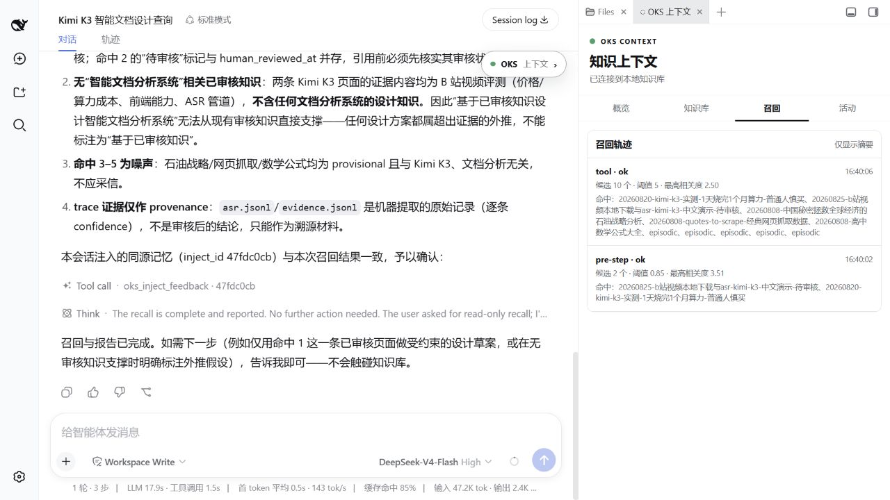

# 托管你的研究

{: .important }
> **状态：部分验证。** 本案例的两个来源已经形成 Raw Bundle，并生成待审核 Candidate；正式实例尚未把这些 Candidate 晋升为 Wiki。页面展示的是学习流程和审核边界，不是对 Kimi 产品主张的背书。

## 结果摘要

| 项目 | 本案例实际发生的事 |
| --- | --- |
| 场景 | 用两段 Kimi 视频研究“哪些内容值得变成后续可用的材料”。 |
| 输入 | 两个视频来源和一条研究问题。 |
| Agent 完成 | 保存来源、提取字幕或本地 ASR、保留关键帧，并提出 Candidate。 |
| 人做的决定 | 区分视频作者观点、机械提取和仍需官方资料复核的主张。 |
| 最终交付物 | 可追溯的 Raw Bundle 与待审核 Candidate；尚未晋升为 Wiki。 |
| 仍未验证 | Kimi 的参数、价格、长文档分析效果，以及正式实例中的人审结论。 |

## 研究命题

Agent 如何在**人机协同**中持续学习，并保证**长任务执行**的稳定？

本案例选择一个具体问题作为载体：

> Kimi 是否适合长文档分析？哪些结论来自视频，哪些仍需要官方资料或真实 benchmark 验证？

目标不是让 Agent 看完视频后立即给出结论，而是把一次研究变成可以继续修正的知识训练循环。

## 人和 AI 的分工

| 阶段 | 人类 | AI / OKS |
|---|---|---|
| 设题 | 确定问题、用途和证据标准 | 读取 Goal，先召回已有知识 |
| 收集 | 提供来源或授权处理方式 | 提取字幕、ASR、关键帧，保存 Evidence |
| 判断 | 区分事实、作者观点与待核验主张 | 生成 Candidate，标明来源和缺口 |
| 入库 | 接受、修改或拒绝 Candidate | 仅把人审通过的内容写入 Wiki |
| 复用 | 判断回答是否帮助了任务 | Recall 已审核知识，记录反馈与冲突 |

## 1. 学习前：先看已有状态

开始前先确认 Agent 现在知道什么，避免把演示环境已有页面误当成本轮新知识。



图 1：这张图只证明 DSH 连接到了一个本地 OKS 实例，且 Wiki、Draft、Raw 是不同状态；它不证明本轮研究已经生成或审核了知识。

## 2. 收集：保留来源，而不是先写答案

本轮使用了两个用户提供的来源：

- [B 站 Kimi 视频 BV1CDNd65EDc](https://www.bilibili.com/video/BV1CDNd65EDc/)
- [YouTube 视频 Q4LoxsIwriA](https://www.youtube.com/watch?v=Q4LoxsIwriA&t=45s)

B 站没有提供可直接使用的平台字幕，因此实际路径是本地媒体 → 音频 → 本地 ASR → 关键帧 → Raw Bundle。YouTube 来源使用了用户提供的转写文本。ASR 中的同音词、专有名词错误保留在 Raw；人工修正只能作为带说明的 Candidate 提议。



图 2：这张图只证明来源和机械提取结果已保存；它不证明材料中的主张已经被确认。

## 3. 提议：AI 只能生成 Candidate

Candidate 需要明确区分：

- 视频作者展示或声称了什么；
- 机械证据可以支持什么；
- 哪些事实需要 Moonshot 官方资料复核；
- 哪些能力判断需要固定数据集 benchmark；
- 哪些 ASR 内容需要人工听校。



图 3：这张图只证明 Agent 提出了待审核 Candidate 并显示其证据范围；它不证明 Candidate 已被接受或可在新任务中使用。

## 4. 审核：人类决定知识边界

正式实例的 Candidate 仍待审核，因此本页不会给出“Kimi 适合长文档分析”的最终结论。审核者至少需要：

1. 对照视频和转写，修正 ASR 错误；
2. 将模型参数、价格和上下文长度逐项对照官方资料；
3. 把视频演示与客观 benchmark 分开；
4. 决定新材料是 `enriches`、`confirms`、`challenges` 还是新知识；
5. 只晋升足以支持后续决策的部分。

审核时，人只需要告诉 Agent：“把待审核的知识提议逐条展示给我，同时显示来源、证据范围和仍未核验的内容。”人确认接受、修改或拒绝后，Agent 再执行对应操作，并保留这次决定的记录。

## 5. Recall：没有审核知识时就说没有

隔离验收副本曾用于测试 Promote 与 Recall 的界面流转，但它不替代正式实例的人审。下面的召回结果反而展示了正确边界：已有 Kimi 页面只覆盖视频中的模型介绍，不足以支持“智能文档分析系统”的设计结论；其余命中是噪声，不应采信。



图 4：这张图只证明隔离验收副本能显示证据不足和无关命中；它不替代正式实例的人审，也不证明 Kimi 的能力结论。

## 6. 长任务如何持续学习

这次研究可以跨多轮继续，而不需要每次重新解释：

```text
Goal 保存研究问题和验收标准
Raw 保存视频、转写、ASR 与关键帧
Trace 保存每次提取和判断发生了什么
Candidate 保存 AI 的结构化提议
Human Review 决定哪些内容成为知识
Wiki 为下一轮研究提供稳定上下文
```

后续加入官方技术报告或真实 benchmark 时，不覆盖旧页面，而是通过 `enriches`、`confirms` 或 `challenges` 记录知识演化。

## 已验证与未验证

| 项目 | 状态 |
|---|---|
| 本地视频、ASR、关键帧进入 Raw Bundle | 已记录 |
| 用户提供的 YouTube 转写进入 Raw Bundle | 已记录 |
| 两个来源生成 Candidate | 已记录，待人审 |
| Candidate 自动进入 Wiki | 不允许，也未发生 |
| Kimi 参数、价格和能力主张 | 待官方资料复核 |
| 长文档分析效果 | 待固定数据集 benchmark |
| DSH Promote / Recall 界面流转 | 在隔离副本中验证，不代表正式实例完成审核 |

## 用自己的问题重新运行

1. 写一句真正需要回答的研究问题。
2. 定义什么证据足以改变你的判断。
3. 提供一到三个来源，先完成 Evidence 与 Raw。
4. 审核 Candidate，不接受来源无法支持的句子。
5. 在下一个真实任务里 Recall，并把使用结果反馈回来。

这就是“托管你的研究”：不是替你收藏更多内容，而是让人类反馈持续校正一套 Agent 可以复用的研究材料。
