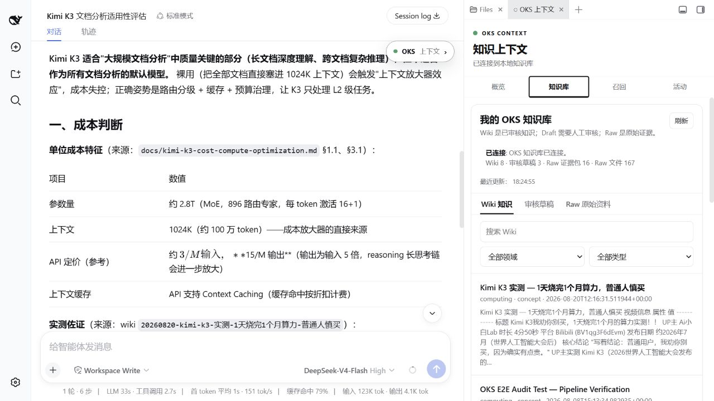
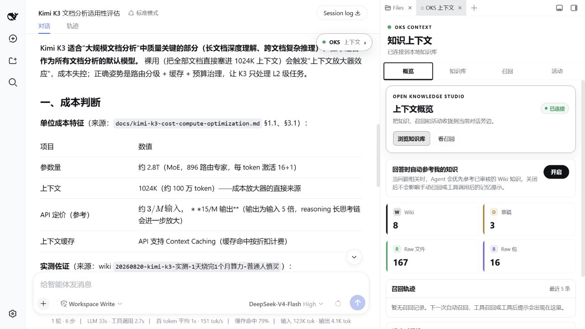
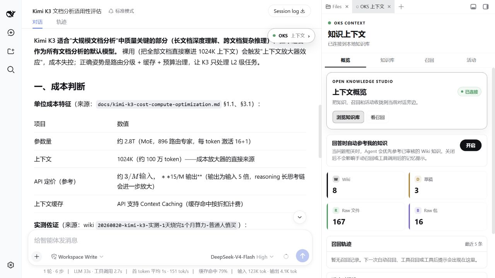
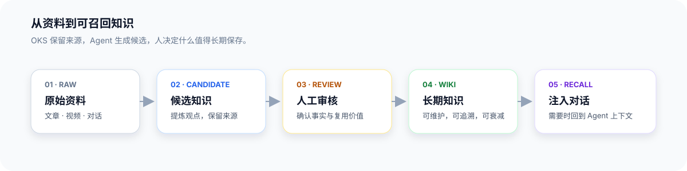

# 快速开始
{: .no_toc }

30 秒看懂 OKS，5 分钟上手使用。
{: .fs-6 .fw-300 }

---

## Codex 一键安装

复制下面这段话，粘贴给你的 AI 助手（Codex、Claude Code、Cursor 等）：

```
帮我安装并开始使用 OKS。请先阅读并按照这个 Skill 操作：
https://raw.githubusercontent.com/open-agent-power/open-knowledge-studio/main/SKILL.md
```

**Agent 会自动完成**：
- ✅ 检查环境（Python 3.12+、pipx）
- ✅ 安装 OKS CLI
- ✅ 初始化知识库
- ✅ 安装 9 个 skills（`/ingest`、`/query`、`/promote` 等）
- ✅ 配置自动召回 hook
- ✅ 验证安装成功

**用时**：2-3 分钟（首次安装）

---

## 团队工作区

个人知识库用 `oks init`；需要多人共享、提交和审核同一套知识时，用团队入口：

```bash
oks team init ./team-knowledge-studio --name "Platform Knowledge Team"
cd ./team-knowledge-studio
oks status
```

它仍然使用 `profiles/`、`raw/`、`drafts/` 和 `wiki/` 这套目录。团队画像在 `profiles/team.md`，共享目标在 `profiles/goals/team.md`；成员加入后再绑定自己的 profile 和团队目标。

```bash
oks registry bind --profile <user-id> --goals team
```

团队初始化的详细边界见 [Profiles 画像](usage/profiles.md)。

---

## DeepSeek Harness 集成

如果你使用 DeepSeek Harness（DSH），可以安装可视化插件：

### 安装插件

```bash
dsh plugin add github:open-agent-power/dsh-oks
```

### 配置路径

1. 打开 DSH 设置面板
2. 找到 "OKS" 插件
3. 设置知识库路径（例如：`~/my-knowledge-base`）

### 功能预览



**可视化管理**：
- 查看 Wiki / Draft / Raw 统计
- 一键开关自动召回
- 浏览器界面审核草稿

---

## 初级案例：学习 Kimi K3

完整演示如何从 B 站视频到可召回的知识。

### 步骤 1：准备素材

找一个 B 站视频，比如：
```
《Kimi K3 实测：20元一次，适合大规模文档分析吗？》
https://www.bilibili.com/video/BV1qg3F6dEvm
```

### 步骤 2：入库

在 Codex 或 DSH 对话框中说：
```
请帮我从这个视频提取知识并保存到 OKS：
https://www.bilibili.com/video/BV1qg3F6dEvm
```

**Agent 会自动**：
1. 检测到视频 URL
2. 下载视频 + 字幕（如果有 `watch` capability）
3. 提取关键信息
4. 生成 Draft 草稿

### 步骤 3：审核草稿

**方式 A：DSH 可视化**
1. 打开 DSH 设置面板
2. 找到 OKS 插件
3. 查看 "审核草稿"（应该有 1 篇新草稿）
4. 点击 "提升为 Wiki"

**方式 B：命令行**
```bash
oks drafts list
oks drafts promote kimi-k3-实测
```

### 步骤 4：开启自动召回

**DSH 用户**：
- 打开 DSH OKS 设置
- 启用 "回答时自动参考我的知识"



**Codex 用户**：
- Hook 已在安装时自动配置
- 无需额外操作

### 步骤 5：测试效果

在对话框中提问：
```
Kimi K3 适合用来做大规模文档分析吗？
一个月大概多少成本？
```

### 步骤 6：查看对比

**Before（无知识库）**：
```
AI: "我不太了解 Kimi K3 的具体定价和性能表现..."
```

**After（有知识库）**：
```
AI: "基于你的知识库（Kimi K3 实测），我的建议是：

不要把 K3 作为所有文档的默认模型

原因：
- 长上下文和 reasoning 会放大单次成本
- 批量、重复和低风险任务不需要最高档模型
- 需要路由、缓存、压缩和预算墙

建议方案：
- 复杂、质量关键的任务再路由到 K3
- 低风险任务走更便宜的模型或本地模型

来源：B站 Ai小白Lab 实测视频"
```



**关键价值**：
- ✅ 有理有据（基于真实测试）
- ✅ 可追溯来源
- ✅ 实测、估算和判断分开标注
- ✅ 自动召回，无需手动查询

---

## 工作原理



提问时，Agent 先从审核后的 Wiki 中召回相关知识，再把命中内容和来源注入当前上下文。Raw 和 Draft 不会因为“被读过”就自动成为长期记忆。

---

## 下一步

### 🎓 深入学习
- [从这里开始](start-here.md) - 理解核心概念
- [首次知识循环](first-knowledge-loop.md) - 完整操作流程
- [最佳实践](best-practices.md) - 优化使用技巧

### 📚 查看案例
- [托管你的学习（仓库案例）](https://github.com/open-agent-power/open-knowledge-studio/tree/main/examples/oh-my-research/) - 从资料沉淀可召回知识
- [Kimi 产品学习案例（仓库案例）](https://github.com/open-agent-power/open-knowledge-studio/tree/main/examples/oh-my-kimi/) - 从视频学习 AI 产品
- [更多案例](examples.html) - 案例索引

### 🛠️ 进阶功能
- [导入对话记录](import-conversations.md) - 批量导入历史对话
- [验证与测试](verify.md) - 确保召回质量
- [上下文注入](usage/context-injection.md) - 理解召回机制

---

## 常见问题

### Q: 为什么需要 Python 3.12+？
A: OKS 使用现代 Python 特性（`str | None` 联合类型、`itertools.batched` 等），需要 3.12+ 支持。

### Q: pipx 和 pip 有什么区别？
A: `pipx` 为每个工具创建独立虚拟环境，避免依赖冲突。Ubuntu 24.04+ 和 macOS Homebrew Python 要求使用 `pipx`。

### Q: DSH 插件必须吗？
A: 不是。DSH 插件提供可视化界面，但 OKS CLI + Hook 已经足够使用（Codex、Claude Code 等）。

### Q: 视频能力（watch）必须吗？
A: 仅处理视频时需要。Agent 会在检测到视频任务时询问是否安装（~10MB，免费）。

### Q: 知识库可以多个项目共享吗？
A: 可以。用 `oks config set knowledge_base_path <path>` 设置全局路径，所有项目共享一个知识库。

---

## 推广语

**分享给朋友**：
```
Agent 也能有长期记忆了！

OKS（Open Knowledge Studio）让 AI 助手记住你教过它的知识：
- 从 B 站视频/文章/对话中自动提取知识
- Agent 对话时自动召回相关内容
- 可视化管理（DSH 插件）

Codex 一键安装：
https://raw.githubusercontent.com/open-agent-power/open-knowledge-studio/main/SKILL.md

完整文档：
https://github.com/open-agent-power/open-knowledge-studio
```

---

{: .note }
> **提示**：本页所有截图都是真实演示。想看完整案例？查看 [案例演示](examples.md)。
