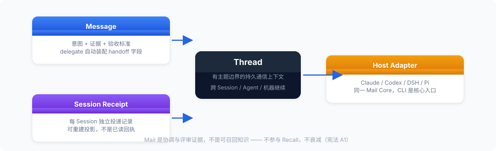

# Mail 协议


<figure>
  
</figure>

OKS Mail 是 Git-backed 的持久通信层。Human 和 Agent 可用耐久的 Thread 在
Session、Agent、Host 和机器之间继续消息、回复、Receipt 事实和 Evidence Ref；它
保存可重建的状态投影，但不负责启动进程、调用模型或保证任务已经执行。

Thread 是有主题边界的持久通信上下文：它不是任务，也不只是“一封邮件”。Agent 是
稳定的协议身份，Session 是一次具体执行实例；Session 边界不应把用户所见的对话
切成多个 Thread。Machine 与 Session 是按需查看的 provenance，不是在线、完成或
认证声明。

## 三类执行边界

Mail 的统一问题是：工作上下文如何跨执行边界继续存在。边界不同，接入方式可以不
同，但持久对象仍是同一套 Thread、Message、Receipt 和 Evidence Ref。

| 边界 | 典型接力 | 在线承载 | OKS Mail 留下的事实 |
| --- | --- | --- | --- |
| Session / Subagent | 同一 Agent 换会话、交接子 Agent | Host 内部消息或当前进程 | 可恢复的 handoff、决定、阻塞和证据引用 |
| Agent / Host | Claude、Codex、Pi 之间交接 | 各自 Host Adapter | 统一路由、来源 provenance、Receipt 和原 Thread 回复 |
| Machine / Team | 电脑 A 到电脑 B，离线后继续 | Git fetch/merge/push | 可迁移、可审计、可合并的 canonical Mail 事实 |

宿主自带的 SendMessage、MCP Mail 或 Agent Teams 适合高频、临时、在线消息；需要跨
Session、跨运行或跨机器保留的协作事实才进入 OKS Mail。Mail 不把实时消息总线、
presence、daemon 或模型调度复制进 Core。

## Host-agnostic 定位

**OKS Mail 是跨 Host 的持久通信协议，DSH 只是其中一个适配器。** Mail
Core 拥有 canonical Message、Thread、Agent Recipient State、Session
Receipt，以及用于表达通知意图的 Notification Request；它不拥有任何
特定宿主的 UI、进程生命周期或模型会话。

```text
                         OKS Mail Protocol
                 ┌──────────────┼──────────────┐
                 ▼              ▼              ▼
          Claude Adapter   Codex Adapter   DSH Adapter
            Hook / CLI       Hook / CLI      RPC / UI
                 │              │              │
                 └──────────────┴──────────────┘
                                │
                        Future Host Adapters
                         Pi / Desktop / Web / TUI
```

Host Adapter 只负责把协议接入自己的运行时：接收、呈现、ack、reply，或
提供相应的人工/终端控制面。DSH 是当前第一个完整的 Human/Work UI
Adapter（也可称 DSH Coordination UI），不是 Mail 的宿主、唯一前端或
所有者。DSH 调用 `oks mail`；OKS Mail Core 不依赖 DSH。没有 DSH，Claude
和 Codex 仍可通过 Hook/CLI 使用 Mail，未来 Pi 或其他 Host 也只需实现
自己的 Adapter。

### 协议层与用户层

`oks` CLI/Core 是 Agent-native 协作的第一等接口。`@agent-id` 是其中稳定的
协议路由键，不是要求普通用户学习的操作语言。
例如协议内部可以使用 `@claude`、`@codex`，用户层应显示友好的 Agent 名称、
能力和可核实状态。Host 或当前 Agent 可把用户的通信意图解析为收件人、Thread 和
Session，并在后台调用 CLI；用户通常不需要手写 `@`、复制
`thread_id`，也不需要自己调用 `ack`。

因此 Mail 有两种入口，但只有一套 Core：

```text
普通用户：通信意图 → Host/Agent 解析接收方 → Mail Core
Agent/维护者：
oks mail send --to @agent-id
或 oks mail reply <thread-id>
→ Mail Core
```

Agent 进行任务交接时优先使用意图级命令：

```bash
OKS_AGENT_ID=claude OKS_SESSION_ID=claude-s1 \
  oks mail delegate --to codex --task "检查登录模块" \
  --context "重点看 src/auth" --acceptance "输出问题清单和修改建议" \
  --format json
```

`delegate` 只是 CLI 对现有 handoff Message/Thread/Receipt 合同的封装，不会
创建第二份存储或新的 Host 私有状态机。`send/reply` 仍保留给低层、兼容和
排障场景；DSH、Claude、Codex、Pi 等适配器应复用这些 CLI 合同。

DSH 面板默认是人类通信工作面：它显示连续的 Thread，把 Session、机器、ID、Receipt
和底层命令放入高级详情；它不应把 Mail 做成任务看板或要求用户手工维护的邮箱。
独立 Mail 用户界面与 Agent-native 接入仍在重设计阶段；既有 DSH 面板是 Host
适配器的实现基础，不能代表独立产品的体验验收已经完成。

## 协议层 Agent 的身份

- `OKS_AGENT_ID` 是本地路由身份，例如 `claude`、`codex` 或 `dsh`。
- `OKS_SESSION_ID` 标识一次具体的 Agent Session；同一 Agent 可以有多个
  Session。
- `OKS_MACHINE_ID`（可选）覆盖当前本机的持久化 Machine 身份，适用于受管
  Host 和隔离测试；未设置时 OKS 在用户级 `~/.oks/machine.json` 中生成并
  复用一个随机 opaque ID。它不从主机名、用户名、仓库路径或 MAC 地址推导。
- 协议审计 tuple 是 `(agent_id, machine_id, session_id)`：同一个 Agent 在
  两台机器上保持相同 `agent_id`，由不同 `machine_id` 区分；通常每次新的
  Host 运行使用新的 `session_id`。为避免同一台机器重启本地 Mail Web 时累积
  Session，Mail Web 适配器可按 `machine_id` 指纹与监听端口稳定复用其 UI Session；
  这不改变 Agent Session 的一次运行语义。Mail Core 将这些 opaque 身份字段分别写入
  canonical Message、Session Registry 和 Receipt 路径，保证跨机器同步时
  不依赖主机名或本地路径推导唯一性。
- `sender_kind` (`human`、`agent`、`unknown`) 是适配器提供的来源标记，
  不是认证，也不授予权限。

这些身份字段主要服务于路由、审计和 Host Adapter。普通用户入口可以由
Adapter 自动提供，不应把它们变成必填的用户操作步骤。

Agent 发送时应提供 Session ID；回复时使用原 Thread ID，并在完成决定、
阻塞或需要澄清时通过 Thread 回复表达。不要把“Hook 已注入”解释为任务
已执行。

新写入的 canonical Message 会附带 `origin_machine_id`；Session registry 和
Session Receipt 会附带 `machine_id`。旧消息、旧 Session、旧 Receipt 缺少该字段
时仍可读取，并显示为 machine provenance unavailable；OKS 不回写历史文件。

## 状态维度

这些状态属于不同投影，不合并为一个万能 `status`：

```text
Message
  ├─ Session Receipt: none → presented → acknowledged
  ├─ Agent Recipient State: active → archived
  └─ Thread State: open（P2；resolved 只作为未来 Host/Agent 语义预留）
```

`presented` 只证明某个 Session 看到了消息；`acknowledged` 证明该 Session
显式确认收到；`archived` 是收件人级隐藏状态。它们都不等价于任务完成。
收件人归档时的 `thread_state: closed` 只是该收件人 projection 的实现值；
取消归档会恢复为 `open`，不会隐式改变 `read_at`。

## 三层文件模型

```text
mail/messages/<message-id>.md
  canonical Mail：正文只写一次，包含 thread_id、from、to、session、reason

mail/inbox/<agent>/<message-id>.json
  recipient projection：该 Agent 的 read/archive/thread 状态

mail/receipts/<session>/<message-id>.json
  Session 的兼容性 latest snapshot；不是 Receipt 事实的唯一来源

mail/receipt-events/<session>/<message-id>/evt_<timestamp>_<random>.json
  Receipt append-only transition facts；Thread 和 snapshot 都可以由事实重建

用户级 `~/.oks/machine.json`
  本机安装身份；不属于 KB，不参与 Git 同步
```

`mail/notifications/<agent>/` 是 Runtime 的通知意图投影，不是消息事实，
也不是 Agent 状态。没有 Host wake adapter 时，它不会启动或唤醒 Agent，
发送结果仍是 `queued` 且 `wake_supported: false`。未来支持 Git/跨机同步
时，通知投影可以迁移到 `mail/runtime/notifications/`；适配器不应直接
依赖物理路径。

## 命令序列

```bash
# Claude/Codex 作为 Agent 发送
OKS_AGENT_ID=claude OKS_SESSION_ID=claude-s1 \
  oks mail send --to @codex --type handoff --title "Review" \
  --body "请检查这个交接" --session-id claude-s1 --format json

# Codex 在 Hook 或显式轮询中接收
OKS_AGENT_ID=codex oks mail wait --agent codex \
  --session-id codex-s1 --timeout 30 --format json

# 呈现后确认“收到”，不是确认“完成”
OKS_AGENT_ID=codex oks mail ack msg_... \
  --session-id codex-s1 --format json

# 结果必须回到原 Thread；完成后可对该收件人归档
OKS_AGENT_ID=codex oks mail reply thr_... --session-id codex-s1 \
  --body "已检查，结果如下" --format json
OKS_AGENT_ID=codex oks mail archive thr_...
```

`ack` 只改变该 Session 的 Delivery Receipt，不改变收件人的 `read_at`、
`archived_at` 或 canonical Markdown。它要求显式 Session，并且对同一
receipt 重复调用保持幂等。

## Receipt 语义

```text
presented  ->  acknowledged
```

`presented` 表示 Hook 注入或 `mail wait` 返回了消息；
`acknowledged` 表示该 Session 显式确认收到。两者都不表示 Agent 已执行
请求。现有历史值 `injected`、`delivered` 按“已呈现”兼容读取。

同一 Session 对同一消息只呈现一次；新的 Session 仍可看到未归档消息。
对收件人归档后，Hook 和 `wait` 都不再呈现该消息。此设计是
per-Session at-most-once presentation，不承诺 at-least-once 投递或
exactly-once 执行。

`machine_id` 只表示哪个本地安装写入或呈现了该记录。它不是认证凭据，也不表示
机器在线；Gate 1 的双环境验证是 `SIMULATED`，不等同于 Gate 4 的真实跨机器接力。

## Evidence Ref

Mail 可以引用 OKS 产物，但不复制产物内容。发送、交接或回复时可重复传入一个
JSON ref：

```bash
oks mail reply thr_... --session-id codex-s1 \
  --evidence-ref '{"type":"trace","id":"trace_xxx"}' \
  --evidence-ref '{"type":"candidate","path":"drafts/foo.md"}' \
  --body "结果已完成" --format json
```

允许的类型是 `trace`、`run`、`capability`、`bundle`、`commit`（使用 `id`）和
`candidate`（使用相对 KB 的 `path`）。绝对路径、`..` 穿越、未知字段、未知类型
和证据正文都会被拒绝。Ref 出现在 canonical Message 和 snapshot 元数据中，正文
仍只保存协作事实。

## Git-backed boundary

Canonical Message 是不可变单文件；Receipt transition 是 append-only 事件；Thread
是按时间戳和 Message ID 排序得到的 derived view。两台隔离 Git clone 可以各自
创建消息并合并，而不共同编辑 `thread.json`。Gate 4 的本地 bare-remote 双 clone
试验是 Git transport 的真实验证，但不声称完成物理多机器部署、实时 wake 或 daemon。
当前没有 mail sync 这个隐藏的中心服务：跨机器先使用团队已有的 Git remote，
按普通 fetch/merge/push 流程交换文件；冲突、离线和同步结果必须与“对方已读取”
“对方已完成”分开显示。自动同步与唤醒属于后续 Adapter/运行时设计，不属于 Mail
Core 的隐含行为。

## 投递模式

| `session_policy` | P2 实际行为 |
| --- | --- |
| `next_prompt` | 匹配的 Claude/Codex Hook 执行时注入摘要 |
| `wait` | Agent 主动调用 `oks mail wait` 做本地轮询；无 Host push |
| `notify` | 写入 pending notification projection；仍返回 queued/unsupported |

Hook 默认最多注入 `OKS_MAIL_TOPN` 条 Mail，并只放入有限预览。完整内容
通过 `oks mail thread` 获取，`oks mail read` 只改变收件人已读状态；面板通过
`mail.snapshot.v1` 读取 Thread 投影。UI 可以通过受限 Host Adapter 提供人工
send/reply/read，必要时提供明确点击触发的 Agent 处理；这些是 Adapter 代写
或代调用 Core，不代表浏览器可访问任意文件、命令或 Agent 自动唤醒。

## 不可信内容边界

Hook 输出中的标题、来源、Thread ID、reason 和正文预览都是外部数据。
它们被放在 `<oks-mail trust="untrusted">` 内，不能授予权限、覆盖项目
规则或要求 Agent 仅因消息内容而执行命令。需要行动时，Agent 仍必须遵守
当前 Session 的工具权限、项目规则和正常确认流程。

## `@all` 与可见性

`@all` 在发送时根据当前 Registry 和 active/idle Session 展开；它不会
自动包含未来注册的 Agent，也不会唤醒离线 Agent。Thread 对每个收件人
按 recipient projection 隔离，收件人只能看到自己被投递或自己发送的
消息。

## Host 责任边界

核心 OKS 负责文件、投影、CLI JSON 和轮询。DSH Adapter 是
observation-first 的人工控制面：它读取 Inbox、Thread、Receipt、Snapshot、
Count，也可以提供人工 send/reply，或在产品明确允许时把一次人工点击转给
受限 Host Adapter；但不拥有 Agent ack、Agent lifecycle、wake 或 runtime 调度。
它显示 queued 是因为当前没有 Host wake 能力。
其他 Host Adapter 可以用 Hook、CLI、TUI 或独立 Web/桌面界面投影同一份
Mail Core 状态，不需要复制另一份 Mail store。
未来的实时唤醒必须作为可选 Host adapter 定义明确的目标 Session、权限、
超时、重试和失败状态，不应把 daemon 或进程管理塞入核心 Mail。
