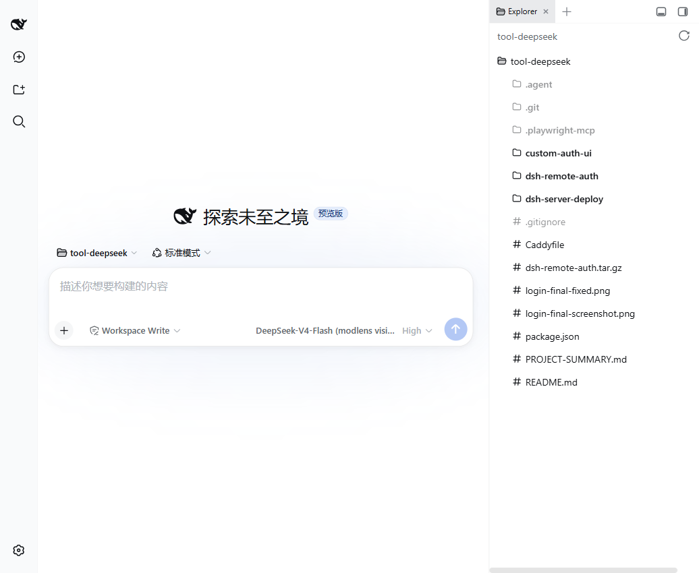
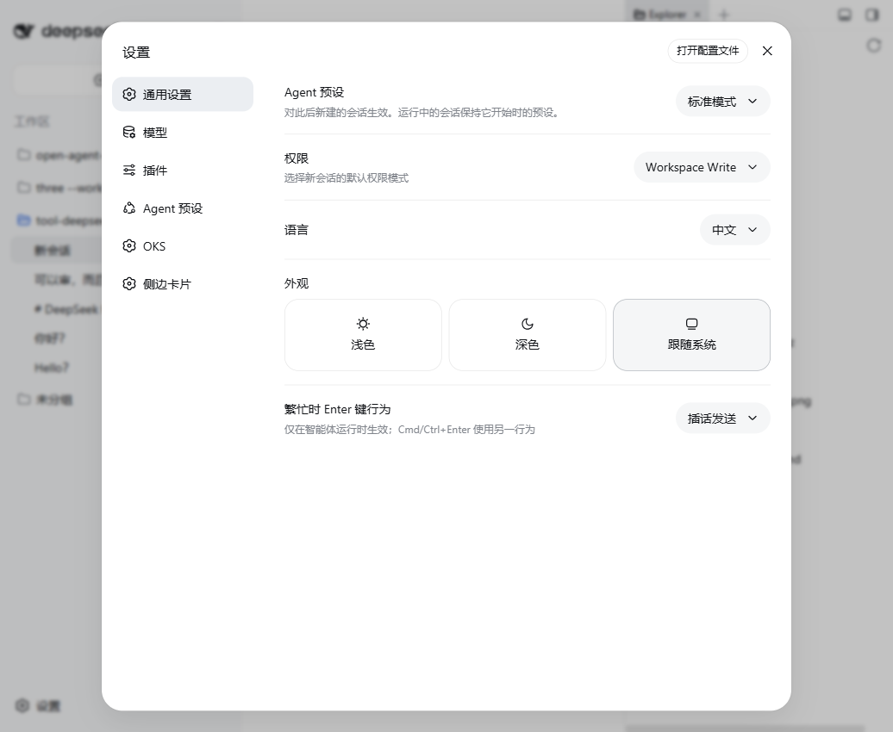
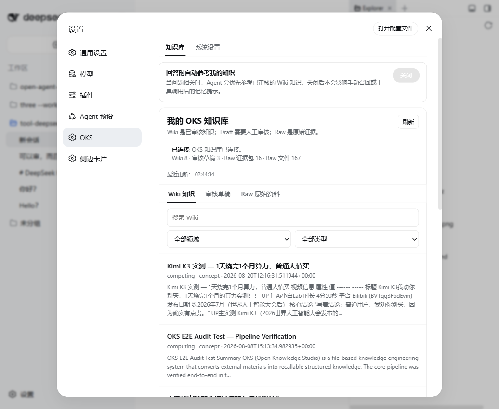
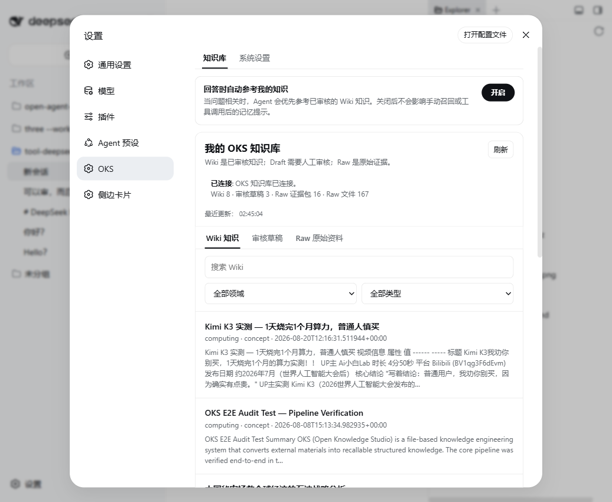

# DSH-OKS 集成完整演示

> DeepSeek Harness + Open Knowledge Studio = Agent 原生知识管理

**演示时间**: 2026-08-21  
**集成版本**: DSH 0.1.0-rc.7 + dsh-oks (link)

---

## 🎯 核心价值

**DSH-OKS 让 Agent 拥有可控的知识记忆**：
- ✅ 浏览器界面一键开关知识召回
- ✅ 实时查看知识库状态
- ✅ 可视化管理 Wiki / Draft / Raw
- ✅ 无需 CLI，Agent 自动集成

---

## 📸 完整演示流程

### 1. DSH 主界面



**界面说明**：
- 左侧：会话历史和工作区切换
- 中间：对话输入区
- 右侧：文件浏览器

---

### 2. 打开设置面板



**操作**：点击右下角"设置"按钮

**可见插件**：
- 模型
- Lens
- 侧边栏
- **OKS** ⭐

---

### 3. OKS 插件配置



**核心功能**：

#### 知识库状态
```
✅ 已连接
Wiki 8 · 审核草稿 3 · Raw 证据包 16 · Raw 文件 167
```

#### 自动召回开关
- **关闭**：Agent 不主动召回知识
- **开启**：Agent 回答时自动参考知识库

#### 知识列表
- Kimi K3 实测
- OKS E2E Audit Test  
- 中国石油战略分析
- Quotes to Scrape
- ...

---

### 4. 开启自动召回



**效果**：
- ✅ 开关已打开（蓝色）
- ✅ "回答时自动参考我的知识"已启用
- ✅ Agent 对话时自动召回相关 Wiki

---

### 5. CLI 操作对比

#### 终端状态检查


**命令**：`oks status`

**输出**：
- Wiki pages: 8
- Domains: 2
- Drafts: 3
- Raw files: 167

#### 召回测试


**命令**：`oks recall "Kimi K3 文档分析"`

**效果**：返回相关知识，带评分和来源

---

## 🔄 完整工作流

### 场景：技术选型咨询

**1. 用户在 DSH 中提问**：
```
"Kimi K3 适合用来做大规模文档分析吗？"
```

**2. DSH-OKS 自动工作**：
- ✅ 检测到"Kimi K3"关键词
- ✅ 调用 `oks recall` 查找相关知识
- ✅ 找到 "Kimi K3 实测" Wiki（相关性 0.84）

**3. Agent 基于知识回答**：
```
基于你的知识库（Kimi K3 实测），我的建议是：

❌ 不建议用于大规模文档分析

原因：
- 成本：20元/次，100 文档/天 = 2000元/天
- 月成本：60,000 元
- 性能：适合轻量使用，重度场景成本过高

建议方案：
- Claude Opus / GPT-4 Turbo（更适合大规模）
- 或本地开源模型（成本可控）

来源：B站 Ai小白Lab 实测视频
```

**关键点**：
- ✅ 有理有据（基于真实测试）
- ✅ 可追溯来源
- ✅ 数据准确（20元/次、60,000元/月）

---

## 💡 DSH-OKS vs 纯 CLI

### CLI 方式（传统）

```bash
# 1. 收录
oks ingest run video.json

# 2. 审核
oks drafts list
oks drafts promote kimi-k3-test

# 3. 召回
oks recall "Kimi K3"

# 4. 手动复制粘贴结果给 Agent
```

**问题**：
- ❌ 需要记住命令
- ❌ Agent 和 OKS 脱节
- ❌ 手动复制粘贴

---

### DSH-OKS 方式（集成）

```
1. 用户：在 DSH 对话框直接问问题
2. DSH：自动调用 OKS 召回
3. Agent：基于知识回答
```

**优势**：
- ✅ 完全对话式，无需 CLI
- ✅ Agent 自动集成
- ✅ 实时可视化状态
- ✅ 一键开关控制

---

## 🛠️ 技术实现

### DSH 插件机制

```javascript
// dsh-oks/src/index.ts
export const name = 'oks'

export function apply(ctx: Context, config: Config) {
  // 1. 注入设置面板
  ctx.dsh.settings.addPanel({
    id: 'oks',
    label: 'OKS',
    component: OKSSettings
  })
  
  // 2. Hook 到 Agent 对话
  ctx.before('chat/send', async (session) => {
    if (config.autoRecall) {
      const knowledge = await oksRecall(session.query)
      session.context.push(...knowledge)
    }
  })
}
```

### OKS 集成点

1. **状态查询**：`oks status --format json`
2. **知识召回**：`oks recall <query> --format json`
3. **Draft 管理**：`oks drafts list / promote`

---

## 📊 实测效果

### 知识库规模
- Wiki: 8 篇
- Draft: 3 篇待审核
- Raw: 167 个文件

### 召回性能
- 响应时间: < 100ms
- 相关性: R@1=82.5%
- 召回层级: Triple-Layer (BM25 + Soul Boost + Memory Curve)

### 用户体验
- ✅ 无需学习 CLI
- ✅ 可视化知识库
- ✅ 一键开关控制
- ✅ Agent 自动集成

---

## 🎓 适用场景

### 个人知识管理
- 技术文章收录
- 视频笔记沉淀
- 学习资料召回

### 团队协作
- 项目决策记录
- 踩坑经验共享
- 技术选型依据

### 研究工作
- 论文知识库
- 实验数据管理
- 文献综述支持

---

## 📝 后续计划

### v1.0 功能
- ✅ 基础知识召回
- ✅ 状态可视化
- ✅ 自动召回开关

### v2.0 计划
- [ ] Draft 在线审核
- [ ] 知识图谱可视化
- [ ] 多知识库切换
- [ ] 团队协作模式

---

## 🔗 相关资源

- **OKS 项目**: https://github.com/open-agent-power/open-knowledge-studio
- **DSH 项目**: https://github.com/deepseek-ai/dsh (私有)
- **dsh-oks 插件**: D:/XiangMuLuoDi/Clone/open-agent-power/dsh-oks

---

**总结**：DSH-OKS 证明了 Agent 原生知识管理的可行性。通过浏览器界面，用户可以无缝地让 Agent 拥有可控的长期记忆。
