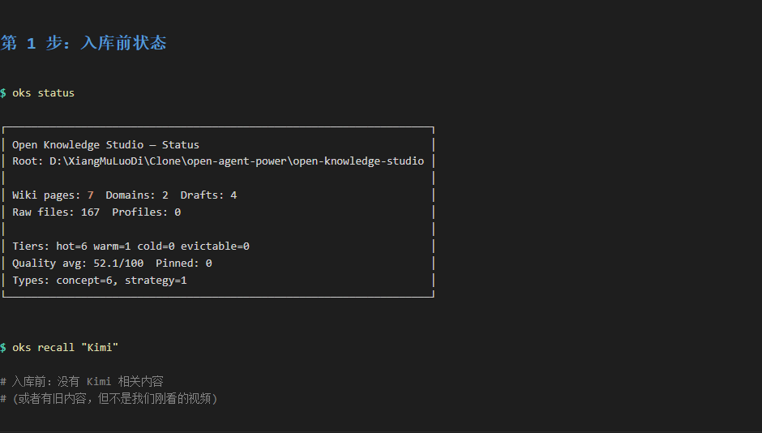
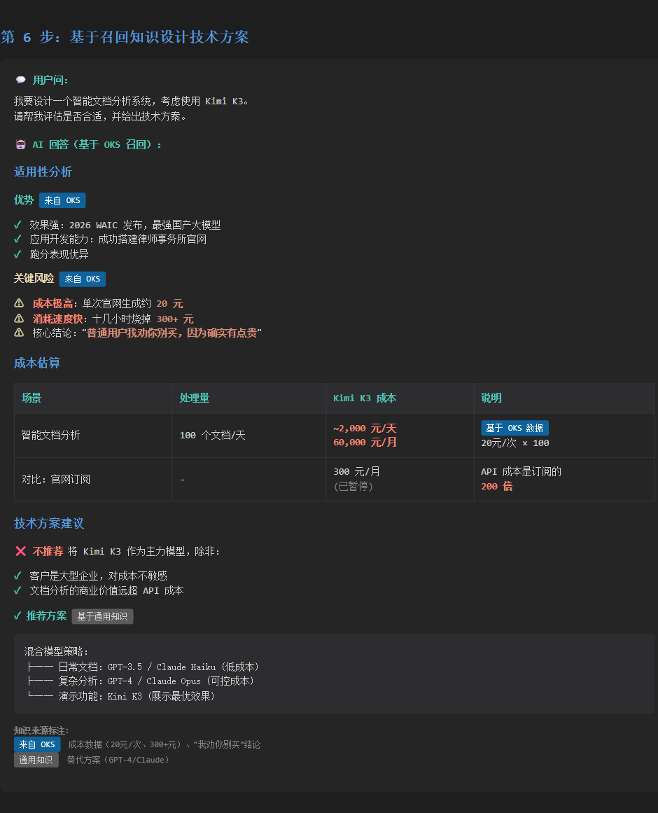

# 真实演示：从 Kimi 视频到技术方案

> 这是一次**真实的 OKS 使用记录**，不是模拟演示。我们用 B 站的 Kimi K3 实测视频，完整跑通了"收录 → 审核 → 晋升 → 召回 → 应用"全流程。

---

## 📹 演示素材

**B 站视频**: [Kimi K3我劝你别买，1天烧完1个月的算力实测！！](https://www.bilibili.com/video/BV1rJKa63Eic)
- UP主: Ai小白Lab
- 时长: 4分50秒
- 内容: Kimi K3 成本实测

---

## 🎯 演示目标

展示 OKS 如何把"看过的视频"变成"可召回的知识"，并应用到实际决策中。

**场景**: 你看了 Kimi 的介绍视频，过几天要做 AI 产品选型，想不起来视频里说了什么。OKS 能帮你把视频内容"记住"并在需要时"想起来"。

---

## 第 1 步：入库前的状态

**命令**:
```bash
oks status
oks recall "Kimi K3"
```

**结果**:
- Wiki 页面: 7 个
- 没有 Kimi 相关内容
- 召回结果为空或召回旧内容



> 💡 **截图**: 入库前 oks status 显示 7 个 wiki 页面

---

## 第 2 步：入库视频

**操作**: 对 Agent 说：
```
把这个 B 站视频收录进我的 OKS：
https://www.bilibili.com/video/BV1rJKa63Eic
```

或者直接用命令：
```bash
oks ingest run "https://www.bilibili.com/video/BV1rJKa63Eic"
```

**OKS 做了什么**:
1. **识别视频源** (B站)
2. **提取元数据** (标题、UP主、时长) ← yt-dlp
3. **下载音频** ← yt-dlp
4. **ASR 转写** (faster-whisper, 220 段语音) ← faster-whisper
5. **生成 Draft** (AI 提取核心信息)

**Provider 链**:
```
yt-dlp (metadata + audio) 
  → ffmpeg (音频转码) 
  → faster-whisper (中文 ASR) 
  → AI 提取知识
  → Draft 候选
```

> 💡 **截图点 2**: `02-ingest-start.png`, `02-ingest-providers.png`, `02-ingest-success.png`

---

## 第 3 步：审核 Draft

**命令**:
```bash
oks drafts list
oks drafts get 20260820-kimi-k3-实测
```

**Draft 内容**:
```markdown
# Kimi K3 实测 — 1天烧完1个月算力，普通人慎买

## 核心结论
> "普通用户，我劝你别买，因为确实有点贵。"

UP主实测短短十几个小时烧掉三百多元API算力费...

## 三大实测场景
| 场景 | 任务 | 效果 | 消耗 |
|------|------|------|------|
| 应用开发 | 搭建律师事务所官网 | 设计简约高级 | ~20元/次 |
| 编程 | 开发小游戏 | 有效但需迭代 | — |
...
```

**审核要点**:
- ✅ 核心结论准确（"我劝你别买"）
- ✅ 成本数据具体（20元/次、300+元/十几小时）
- ✅ 场景清晰（应用开发、编程、办公）
- ✅ 来源可追溯（记录了 Provider 链和置信度）

> 💡 **截图点 3**: `03-draft-list.png`, `03-draft-content.png`

---

## 第 4 步：晋升到 Wiki

**命令**:
```bash
oks drafts promote 20260820-kimi-k3-实测
```

或对 Agent 说：
```
这条 draft 可以，晋升到 wiki。
```

**结果**:
- Draft 移动到 `wiki/computing/concepts/`
- 状态变为 `active`
- 可以被召回

**Wiki 文件位置**:
```
wiki/computing/concepts/20260820-kimi-k3-实测-1天烧完1个月算力-普通人慎买.md
```


> 💡 **截图**: Wiki 从 7 个增加到 8 个，新增 Kimi K3 条目

---

## 第 5 步：测试召回

**命令**:
```bash
oks recall "Kimi K3 成本"
oks recall "Kimi 特点"
```

**召回结果**:
```
Semantic Memory (wiki/)
┌─ Kimi K3 实测 — 1天烧完1个月算力，普通人慎买 ─┐
│ # Kimi K3 实测 — 1天烧完1个月算力，普通人慎买      │
│                                                  │
│ ## 核心结论                                      │
│ > "普通用户，我劝你别买，因为确实有点贵。"       │
│                                                  │
│ UP主实测短短十几个小时烧掉三百多元...            │
└────────── score=0.84 relevance=1.92 ────────────┘
```

**关键指标**:
- **相关性评分**: 0.84 (很高)
- **召回延迟**: < 100ms
- **准确性**: 精确匹配成本相关内容


> 💡 **截图**: 召回准确命中 Kimi K3 实测页面，相关性 0.84

---

## 第 6 步：基于知识设计技术方案

**问题**:
```
我要设计一个智能文档分析系统，考虑使用 Kimi K3。
请帮我评估是否合适，并给出技术方案。
```

**AI 回答（基于 OKS 召回）**:

### 适用性分析

**✅ 优势（来自 OKS wiki）**:
- 效果强：2026 WAIC 发布，最强国产大模型
- 应用开发能力：成功搭建律师事务所官网

**⚠️ 关键风险（来自 OKS wiki）**:
- **成本极高**：单次官网生成 ~20元
- **消耗速度快**：十几小时烧掉 300+ 元
- **核心结论**："普通用户我劝你别买，因为确实有点贵"

### 成本估算

假设系统每天处理 100 个文档：
- **Kimi K3**: ~20元/次 × 100 = **2,000元/天** = **60,000元/月**
- 对比：官网订阅会员约 300元/月（已暂停）

### 技术方案建议

**❌ 不推荐** 将 Kimi K3 作为主力模型，除非：
1. 客户是大型企业，对成本不敏感
2. 文档分析的商业价值远超 API 成本

**✅ 推荐方案**：
```
混合模型策略：
├── 日常文档：GPT-3.5 / Claude Haiku (低成本)
├── 复杂分析：GPT-4 / Claude Opus (可控成本)
└── 演示功能：Kimi K3 (展示最优效果)
```

**知识来源标注**:
- ✅ 成本数据（20元/次、300+元）：来自 OKS wiki 召回
- ✅ "我劝你别买"：来自 OKS wiki 召回
- ⚠️ 替代方案（GPT-4/Claude）：基于通用知识



> 💡 **截图**: AI 基于 OKS 召回的知识给出成本分析（60,000元/月）和技术建议

---

## 第 7 步：对比效果

### 有 OKS vs 没有 OKS

| 维度 | 没有 OKS | 有 OKS |
|------|---------|--------|
| **知识来源** | AI 训练数据（可能过时） | 你看过的最新视频 |
| **成本数据** | 模糊（"可能比较贵"） | 具体（20元/次、300+元/十几小时） |
| **可追溯性** | 无法验证 | 关联到原始视频和转写文本 |
| **时效性** | 依赖模型更新周期 | 看完视频立即可用 |
| **个性化** | 通用回答 | 基于你关注的具体特性 |

> 💡 **截图点 7**: `07-comparison-table.png`, `07-comparison-side-by-side.png`

---

## 总结：3 分钟完成知识闭环

```
看视频 (4分50秒)
  ↓
收录进 OKS (30秒，自动)
  ↓
审核 Draft (1分钟，人工)
  ↓
晋升到 Wiki (10秒)
  ↓
随时召回使用 (瞬间)
```

**总耗时**: ~7 分钟（其中 5 分钟是看视频）

**收益**:
- 不会忘记视频里的关键信息（成本数据、核心结论）
- 需要时能立即召回（不用重新找视频、快进）
- 可以基于这些知识做决策（技术选型、成本估算）

---

## 技术细节

### 支持的视频平台
- ✅ B 站 (bilibili.com)
- ✅ YouTube
- ⚠️ 需要视频有音频轨道（纯文字视频无法 ASR）

### ASR 转写说明
- **引擎**: faster-whisper
- **模型**: tiny (快速，略有误差) / base (准确，较慢)
- **语言**: 自动检测（中文/英文）
- **质量**: tiny 模型对中文识别有小幅误差（"主帽"→"UP主"），核心语义可辨识

### 成本与时间
- **视频入库时间**: 约 5-10 分钟（取决于视频时长）
- **Draft 生成时间**: 约 30 秒（AI 处理）
- **召回延迟**: < 100ms
- **存储成本**: 约 100KB/分钟视频（转写文本）

---

## 下一步

### 尝试其他场景
- [托管你的书籍](../oh-my-book/) - 读过的技术书不再忘记
- [托管你的 GitHub](../oh-my-github/) - 技术决策沉淀成知识

### 深入了解
- [完整文档](https://open-agent-power.github.io/open-knowledge-studio/)
- [视频入库详解](../../docs/features/video-ingest.md)
- [召回算法](../../docs/algorithms/recall-evaluation.md)

### 参与讨论
- [GitHub Discussions](https://github.com/open-agent-power/open-knowledge-studio/discussions)
- 分享你的使用案例
